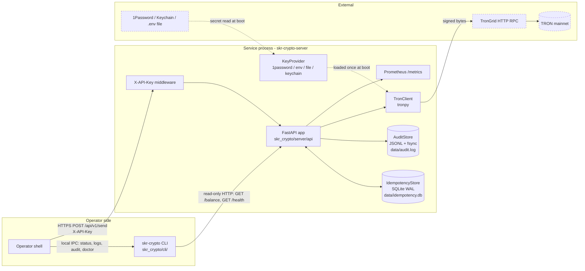
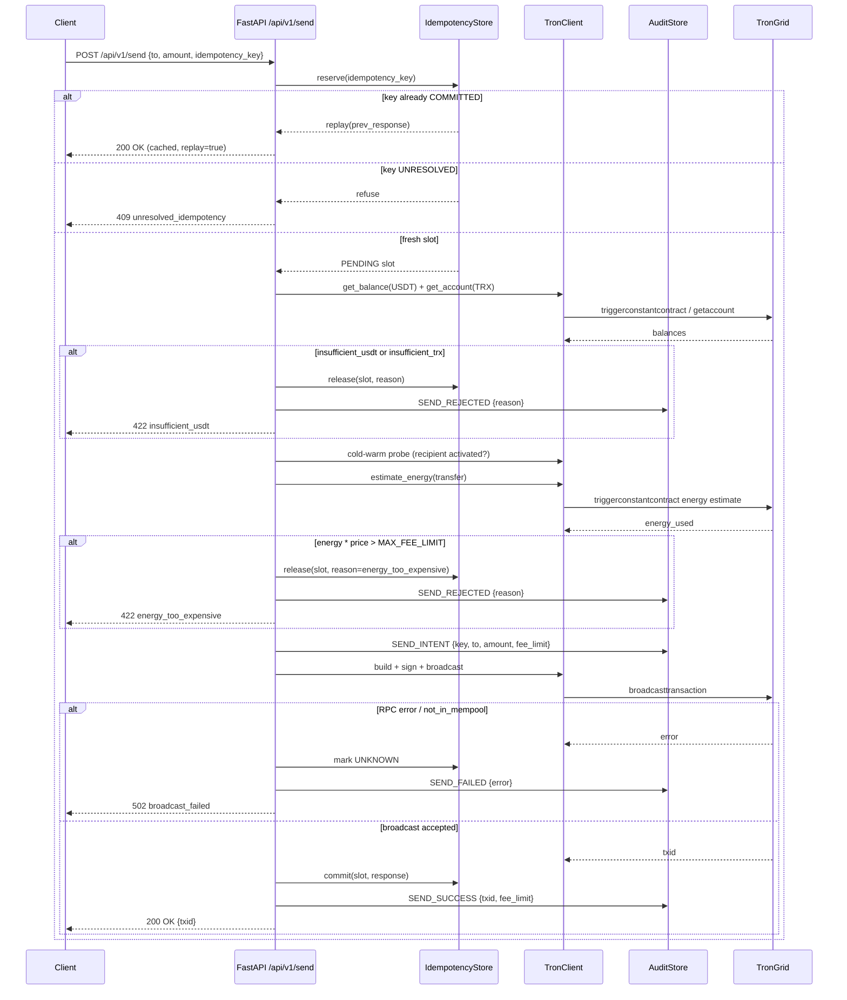
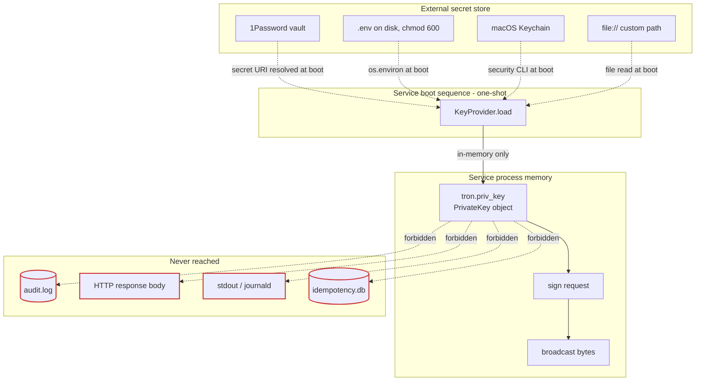

# Architecture

> How `skr-crypto` is wired internally: where state lives, where the private key lives, and what happens between `POST /api/v1/send` and a transaction id on TRON.

This document is the system-design reference. Read [`README.md`](README.md) first if you haven't. Read [`GUIDELINES.md`](GUIDELINES.md) if you're about to send a PR.

---

## Goals & non-goals

**Goals.**

- **Deterministic idempotency.** Same `Idempotency-Key`, same outcome — exactly once, surfaced explicitly. A duplicate request never produces a second on-chain transaction.
- **Durable audit.** Every state transition that affects on-chain reality is appended to disk and `fsync`'d before the API responds. The audit log is the system of record; the database is a derived view.
- **Key-handling discipline.** The TRON private key enters via a `KeyProvider`, lives in the service's process memory, and never crosses any other boundary — not the audit log, not an HTTP response, not stdout.
- **Single-operator usable.** One person, one host, one venv should be enough to run a treasury. The CLI handles install/update/observe/audit; the service handles money.

**Non-goals.**

- HSM or smart-card integration. The KeyProvider abstraction leaves the door open, but we have no plans to implement it.
- Multi-signature transactions. Single-key signing only.
- HD-wallet derivation. One address per deployment.
- Cross-chain support. TRC-20 USDT on TRON, full stop.
- `asyncio` anywhere on the money path. See `GUIDELINES.md` and the [process model](#process-model) section below.

---

## Component diagram



The dashed boundary marks **trust transitions**: the service trusts its own process memory and `data/` directory. It does not trust the network, and it treats the secret source (1Password/Keychain/file) as external — read once at boot, never re-read mid-request.

The CLI never crosses into the service's money path. It reads health/status/balance over HTTP and reads `data/audit.log` and `data/idempotency.db` directly when invoked locally on the same host.

---

## Payout sequence



A few things worth highlighting in the diagram above. The audit row is written **before** the response in every terminal branch — success, rejection, and broadcast failure. The idempotency slot is committed **after** the audit row hits disk; if audit `fsync` raises, the slot stays `PENDING` and recovery handles it (see [Idempotency state machine](#idempotency-state-machine)). Pre-broadcast checks (balance, cold-warm, energy estimate) all `release` the slot rather than committing — they're recoverable; the client can retry the same key.

---

## Data flow with trust boundaries



The private key has exactly one ingress (KeyProvider, called once during app startup), exactly one resident location (a `PrivateKey` instance bound to the `TronClient` singleton), and one egress (the `sign` step inside `broadcast`). The `file://` provider is the only path where the key sits at rest on the service's own disk; in that case `chmod 600` and ownership are enforced at load time and the service refuses to boot if either is wrong.

The forbidden edges are not just policy — they're enforced by structuring the audit and response models around explicit allow-lists of fields. A reviewer who sees a key field added to one of those models on a PR should reject the PR on sight.

---

## Process model

The service runs as a **single uvicorn worker**, on purpose. Request handlers are synchronous Python functions; FastAPI runs them in starlette's thread pool. There is no `asyncio` on the money path. The HTTP framework boundary is the only place async exists, and even that is incidental — we'd be just as happy on WSGI.

Why sync:

- **Determinism.** The audit and idempotency state machines are easier to reason about when there is no cooperative scheduler interleaving them. A `commit()` followed by an `audit.append()` is just two function calls in the same call stack — no `await` between them, no chance of a cancellation arriving in the middle.
- **Boring.** Sync threading bugs are well-understood; `asyncio` race conditions in production are not. We optimize for postmortem-readability, not throughput.
- **No event-loop surprises.** No accidentally-blocking RPC call freezing the loop, no "why is this coroutine never awaited" footguns, no event-loop-affinity issues with libraries like tronpy that aren't async-native.

The trade-off is real: throughput is bounded by the thread pool size and RPC round-trip latency to TronGrid, not by Python concurrency primitives. For a single-operator treasury that's fine. If the service ever needs to push more than a few requests per second, the answer is a queue + multiple workers, not switching to async.

---

## State stores

Both stores live under `$SKR_CRYPTO_HOME/data/` (default `~/.skr-crypto/data/`).

**`audit.log`** — append-only JSON-lines file. One record per state transition. Each write is `os.write` followed by `os.fsync(fd)` on the directory's file descriptor as well, so the record is durable before the API responds. Records carry: monotonic sequence number, ISO-8601 UTC timestamp, event type (`SEND_INTENT`, `SEND_SUCCESS`, `SEND_REJECTED`, `SEND_FAILED`, `RECONCILE_*`, `KEYGEN`, etc.), idempotency key (when applicable), and a typed payload. The file is the source of truth — if the database disagrees, the database is wrong.

**`idempotency.db`** — SQLite, `journal_mode=WAL`, `synchronous=FULL`, single writer. One table, `slots`, keyed by `idempotency_key`. Columns: `state`, `created_at`, `committed_at`, `response_blob`. WAL mode is a deliberate trade: better concurrency for the read path (CLI `audit` queries can co-exist with a writing handler) at the cost of a slightly more complex crash-recovery story. The reconciliation pass on boot is what closes that gap.

**Backup story.** `tar -czf` the entire `data/` directory and ship it. There is no "incremental backup" mode; the directory is small (kilobytes per day) and the audit log compresses well. `skr-crypto backup` does this with rotation. `skr-crypto restore <archive>` extracts it back. Both stop the service first; running them while the service is up is undefined behaviour and the CLI refuses by default.

---

## Idempotency state machine

```
                       reserve(key)
   (no row)  ────────────────────────────►  PENDING
                                              │
                ┌─── pre-broadcast failure ◄──┤
                │                             │
                ▼                             │ broadcast OK
            RELEASED ◄─── retryable           │
                                              ▼
                                          COMMITTED  (terminal, replayable)
                                              ▲
                                              │
   PENDING  ─── crash / kill -9 ───►  UNKNOWN ┴── boot reconciliation ──► UNRESOLVED
                                                                          (terminal,
                                                                           refuses retry)
```

States and what they mean:

- **`PENDING`** — slot is reserved; no broadcast has happened yet, or one is in flight. A second request with the same key blocks (briefly) on the row lock.
- **`COMMITTED`** — broadcast was accepted by TronGrid; the on-chain transaction id is stored in `response_blob`. Subsequent requests with the same key replay the stored response. This is the only terminal-success state.
- **`RELEASED`** — broadcast did not happen; the failure was on the pre-broadcast side (insufficient balance, energy too expensive, contract paused). The slot is removed and the key may be reused. Replay-safe by virtue of being indistinguishable from a fresh slot.
- **`UNKNOWN`** — set when the broadcast call raised, or the process crashed between `broadcast` and `commit`. We genuinely don't know whether the transaction made it onto the chain.
- **`UNRESOLVED`** — what reconciliation rewrites `UNKNOWN` slots to on the next boot. Terminal, but **not replayable**. A subsequent request with the same key returns `409 unresolved_idempotency`.

**Why we never auto-retry an `UNKNOWN`.** Auto-retrying assumes you know the broadcast didn't land. In TRON, a transaction may have been signed-and-sent-and-mined by the time a network blip causes the HTTP response to never reach us. A blind retry there is a duplicate payment. The only safe path is human-in-the-loop reconciliation: operator queries the chain for the relevant address, decides what happened, and either treats the original request as `COMMITTED` (and updates the slot manually via `skr-crypto reconcile --resolve`) or files it under "investigated, no on-chain effect" and unblocks the key. The CLI surfaces the playbook explicitly when `audit --unresolved` is non-empty.

---

## Failure modes & recovery

**Power loss / `kill -9` mid-broadcast.** WAL takes care of SQLite. The audit log is fsync'd after every record. The idempotency slot for the in-flight request is `PENDING` on disk; the next boot's reconciliation pass moves it to `UNRESOLVED` and refuses to auto-retry. Operator follows the unresolved playbook.

**TronGrid outage.** The `TronClient` wraps every RPC in a 15-second timeout with up to 3 retries on connection errors and idempotent reads (`getaccount`, `triggerconstantcontract`). `broadcasttransaction` is **not retried** — it's not safe to assume idempotency on a write. A persistent outage propagates as `502 broadcast_failed`; the slot ends up `UNKNOWN` and follows the unresolved-playbook path.

**Audit write failure.** If `os.write` or `os.fsync` raises, the request fails with `500 audit_write_failure` and the idempotency slot is left `PENDING` (it'll be reconciled on next boot). There is **no silent degradation**: we do not buffer to memory, we do not write to a fallback file, we do not log-and-continue. The audit log is the system of record; if it can't be written, the system isn't running.

**Idempotency collision in flight.** Two concurrent requests with the same key serialize on the row lock. The second one sees the first's outcome via the slot state and either replays (`COMMITTED`) or returns the same error (`RELEASED`).

---

## Why this isn't a microservice fleet

The README jokes that the original CLI was for "the SKR Crypto microservice fleet". The fleet is, today, one process. There is exactly one server (`skr-crypto-server`), one venv, one `data/` directory, one TRON address. The naming is forward-looking — if and when the architecture genuinely needs more than one moving part (a queue, a settlement worker, a reconciliation daemon), the CLI is already shaped to manage it.

Until then: one process, one operator, one host. Anything else is a YAGNI bet we are explicitly not making.
