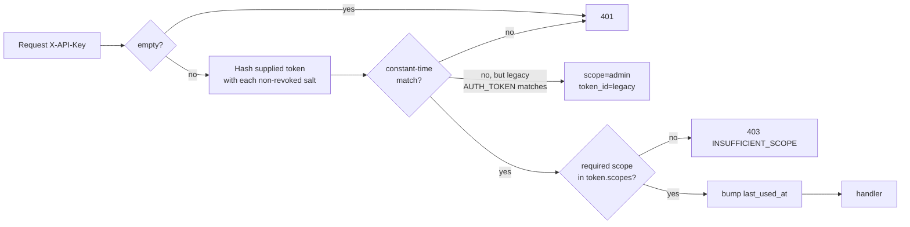

# 0008 — Per-caller API tokens with scopes

## Status

Accepted. 2026-04-30. Introduced in 1.5.0.

## Context

Until 1.4.x the service had **one** authentication token: `AUTH_TOKEN`
in `.env`, compared via `hmac.compare_digest`. Every caller that has
this token can do every action (`/send`, `/balance`, `/wallets`,
`/risk`, `/metrics`, `/health`).

Three operational pains that have surfaced:

- **Blast radius of a leaked token.** If your prod back-office's API
  token gets exposed (a screenshot, a copy-paste into the wrong
  channel, a leaked deploy tarball), the only mitigation is rotating
  the **single** `AUTH_TOKEN` and restarting — which kills every
  legitimate caller at once. Multiple back-offices means multiple
  ways to leak; rotation becomes painful enough that operators put
  it off.
- **Read-only consumers can't be safely fed the token.** A dashboard
  that just polls `/balance` and `/metrics` shouldn't have the
  ability to call `/send`. With one global token, it does.
- **No "who called?" audit dimension.** Every audit record carries
  `client_ip`. That's useful for network-layer forensics but useless
  for "which back-office service did this come from?" — IPs collapse
  behind reverse proxies, NAT, and CDN.

The goal: solve all three without making single-wallet legacy deploys
painful and without compromising the existing audit / risk machinery.

## Decision

Replace the single-`AUTH_TOKEN` model with a **token table** in the
existing SQLite store, with three scopes:

- `admin` — every endpoint, including future write-ops.
- `send` — `/send` + read endpoints (`/balance`, `/wallets`, `/risk`).
- `read` — read endpoints only.
- `metrics` — `/metrics` only (smaller surface for Prometheus scrapers).

Tokens are 32 random bytes (256 bits), encoded as `skr_<base64-32>`
prefix-tagged for accidental-paste detection. Stored in the DB as a
`hmac.compare_digest`-compatible hash (`scrypt(token, salt)`) — never
plaintext. The token is shown **once** on creation, never again.

Schema:

```sql
CREATE TABLE tokens (
    id           TEXT PRIMARY KEY,         -- short uuid for refs
    name         TEXT NOT NULL,            -- operator-chosen label
    hash         BLOB NOT NULL,            -- scrypt-derived 32-byte hash
    salt         BLOB NOT NULL,            -- per-token 16-byte salt
    scopes       TEXT NOT NULL,            -- comma-separated: admin|send|read|metrics
    created_at   TEXT NOT NULL,
    last_used_at TEXT,
    revoked_at   TEXT,
    created_by   TEXT                      -- "AUTH_TOKEN-legacy" or another token's id
);
CREATE INDEX idx_tokens_revoked ON tokens(revoked_at);
```

Lookup is O(N) by design (we hash the supplied token with each
non-revoked salt and compare). N is operator-managed; in practice N <
20. The constant-time compare per row protects against timing leaks
on the right token.

Backwards compatibility is **explicit and bounded**:

- The legacy `AUTH_TOKEN` env var still works, treated as scope `admin`.
- A loud `[AUTH] Legacy AUTH_TOKEN in use — migrate via skr-crypto token create`
  is logged once at boot if `AUTH_TOKEN` is set.
- New deployments don't need `AUTH_TOKEN` at all — `skr-crypto token
  create --name bootstrap --scope admin` is the install-wizard
  follow-up.
- We document the migration path in `docs/migration-1.5.md`.

Auth flow:



Per-route scope requirements:

| Endpoint | Required scope |
|---|---|
| `POST /api/v1/send` | `send` |
| `GET /api/v1/balance` | `read` |
| `GET /api/v1/wallets` | `read` |
| `GET /api/v1/risk/{addr}` | `read` |
| `GET /api/v1/health` | `read` |
| `GET /api/v1/metrics` | `metrics` (or `read`) |
| Future write endpoints | `admin` (default) |

`admin` implies all other scopes. `send` implies `read`. `read` and
`metrics` are siblings — neither implies the other (a metrics scraper
shouldn't see balances; a dashboard that needs both gets `read`).

Audit gains a `token_id` field on every authenticated event, alongside
`client_ip`. Queries become "which token initiated this transfer?"
instead of "which IP did this come from?".

CLI:

```text
skr-crypto token list                        # tabular list with last-used
skr-crypto token create --name X --scope send,read
skr-crypto token revoke <token-id>           # immediate; doesn't kill in-flight
skr-crypto token rotate <token-id>           # = create new with same scopes + revoke old
skr-crypto token show <token-id>             # metadata only; never the token value
```

## Consequences

**Single-wallet single-token deploys keep working.** `AUTH_TOKEN` in
`.env` is still honoured; the deprecation warning is annoying but not
blocking. Existing callers don't see anything change.

**Multi-caller deploys gain the rotation primitive.** Per-caller
revocation without service restart. A leaked token affects only its
own scope.

**Audit becomes more useful.** "Which back-office triggered this
SEND_REJECTED with reason=risk_too_high last week?" is now a query,
not a guess.

**Token enumeration is observable but not exploitable.** Anyone with
filesystem access to `idempotency.db` can list token IDs + names +
scopes (NOT plaintext tokens — only hashes). This is by design;
operators should be able to audit "what tokens exist". The hash is
designed to be useless without the original token.

**The token table is an O(N) compare per request.** With N < 50 and
scrypt at the chosen cost (n=4096, r=8, p=1 — much lighter than
the keystore's KDF, since we hash on every request), this is ~5 ms.
Acceptable for a sync-mainline service that's already doing 100 ms+
TronGrid round-trips per `/send`. If N grows past 100 we'll add an
in-memory LRU cache keyed by hash.

**Revocation is database-backed, not request-backed.** A revoked token
fails on the **next** request, not in-flight ones. For high-stakes
revocation ("token leaked, kill it now") this is fine — in-flight
requests complete, then 401s.

**A new `tokens.py` module joins the CODEOWNERS-protected list.**
Per ADR 0007 — auth code changes need the cooling-off review.

## Alternatives considered

- **Hash the token with HMAC-SHA256 + a server-wide secret.** Faster
  than scrypt. Rejected because if the server-wide secret leaks, every
  token in the DB becomes brute-forceable; with per-token scrypt, the
  cost is per-token-individual.
- **JWT-based tokens.** No DB lookup needed; revocation requires a
  block-list anyway. Adds the JWT library + signing key surface.
  Rejected — the scoping benefit is achievable with a much simpler
  primitive.
- **OAuth 2.0 client credentials.** Industry standard for "service-to-service auth". Massive overkill for an in-house treasury used by 1-5 callers; brings token-introspection endpoints, refresh flows, and dependency on an OAuth library.
- **Per-token rate limit only, no scopes.** Closes the rotation pain
  but not the read-only-callers-can-still-call-/send pain. Doing both
  is the same code; might as well.
- **Bearer-tokens-with-prefix-only-rotated, no scope dimension.** Scoping
  is the highest-leverage piece — without it, the dashboard problem
  isn't solved. Without scopes the change isn't worth doing.
- **Drop `AUTH_TOKEN` immediately, no compat shim.** Cleanest semantically.
  Rejected because every existing deploy would break on upgrade. The
  cost of supporting `AUTH_TOKEN` for one more major version (until
  v2.0) is a single `if AUTH_TOKEN: ...` branch in `tokens.py::verify`.

## Related

- [Multi-wallet pool](../multi-wallet.md) — separate concern, but
  combines naturally with token scopes (per-wallet token scopes are a
  future ADR if needed).
- [ADR 0007](0007-engineering-safety-practices.md) — adding a money-path
  module is the kind of change ADR 0007 governs.
- `docs/migration-1.5.md` — operator-facing upgrade instructions.
- `tests/test_tokens.py` — invariant tests for the auth flow.
