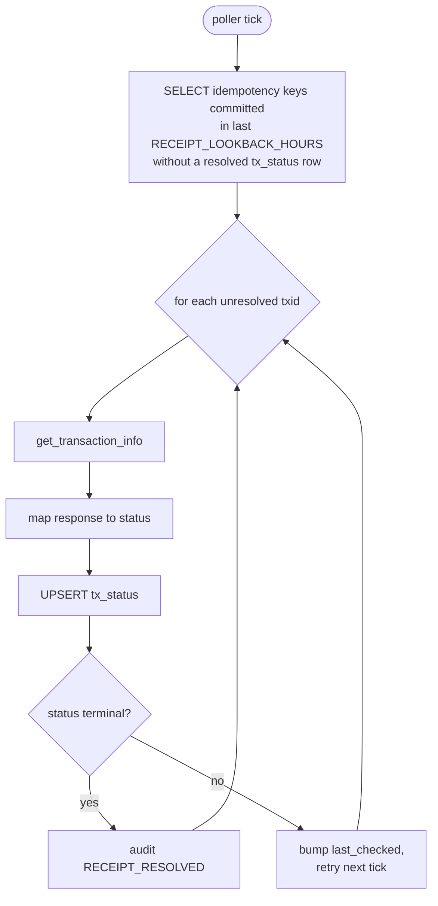

# 0010 — Postmortem-only receipt poller

## Status

Accepted. 2026-04-30. Introduced in 1.6.0.

## Context

The 1.0–1.5 service ends its `/send` flow at the moment TronGrid's
`broadcast` returns `{result: True, txid: "..."}`. We commit the
idempotency slot, write `SEND_SUCCESS` to audit, return 200, and move
on. From the operator's side, the transfer is "done."

But "broadcast" and "landed on-chain" are different events. A
broadcasted transaction can still fail with:

- `OUT_OF_ENERGY` — fee_limit insufficient for the executed energy.
- `REVERT` — USDT contract reverted (recipient blacklisted, paused,
  insufficient owner allowance, etc.). Tether's `isBlackListed`
  preflight catches the common case but not all of them.
- `NOT_FOUND` (after enough time) — broadcast queued but never
  included in a block (rare, usually tx replacement / mempool
  eviction).
- `SIGERROR` — partial signature accepted by `broadcast` then
  rejected at block-inclusion time (we have seen this with stale
  energy estimates).

The current `startup_check` reconciliation catches these on next
boot, but a 24-hour window is too long for an operator to notice
that "broadcast was successful but nothing landed." We need
near-real-time visibility into post-broadcast outcomes — without
adding any retry semantics that could double-spend.

## Decision

Add a **postmortem-only background poller** that:

1. Reads recent `SEND_SUCCESS` entries from the idempotency store
   (we already track `(key, txid, committed_at)` there).
2. For each unresolved txid, calls
   `tron.client.get_transaction_info(txid)` and maps the response
   to one of `SUCCESS / OUT_OF_ENERGY / REVERT / NOT_FOUND / RPC_ERROR`.
3. UPSERTs the result into a new `tx_status` table.
4. On terminal status (`SUCCESS` or any failure code), writes a
   `RECEIPT_RESOLVED` audit event with the on-chain status.
5. **Never** triggers a retry. Never touches idempotency state.
   Never re-broadcasts.

Schema (added to the same `IDEMPOTENCY_DB_PATH` SQLite database):

```sql
CREATE TABLE tx_status (
    txid             TEXT PRIMARY KEY,
    idempotency_key  TEXT,
    first_seen       REAL NOT NULL,
    last_checked     REAL,
    status           TEXT,         -- terminal status when resolved
    block_number     INTEGER,
    last_error       TEXT,         -- short reason for transient failure
    resolved_at      REAL          -- non-null once status is terminal
);
CREATE INDEX idx_tx_status_resolved ON tx_status(resolved_at);
CREATE INDEX idx_tx_status_idempotency_key ON tx_status(idempotency_key);
```

Polling loop:



The poller runs as a daemon thread, started in the FastAPI lifespan
hook after the wallet pool initialises. Cadence is configurable
(`RECEIPT_POLL_INTERVAL_SEC`, default 60). The lookback window is
configurable (`RECEIPT_LOOKBACK_HOURS`, default 48). On each tick we
limit concurrent RPCs (`RECEIPT_POLL_BATCH`, default 20) to avoid
TronGrid quota burn.

A new endpoint `GET /api/v1/tx/{txid}/status` lets operators query
the resolved status synchronously:

```json
{
  "txid": "abc123...",
  "idempotency_key": "invoice-741",
  "status": "OUT_OF_ENERGY",
  "block_number": 68234588,
  "first_seen": "2026-04-30T13:00:00Z",
  "resolved_at": "2026-04-30T13:00:42Z"
}
```

Status `null` means "broadcast committed, poller hasn't reached it
yet". The CLI `skr-crypto check-tx <txid>` reads this endpoint.

Metrics:

- `skr_crypto_tx_landed_total{status="..."}` — counter, terminal
  outcomes per status code. The rate of `failed` / total over time
  is the operator's "did my fee_limit estimate work" curve.
- `skr_crypto_receipt_poll_lag_seconds` — gauge, seconds since the
  oldest unresolved committed txid was committed. Operators alert if
  this exceeds e.g. 600s.

## Consequences

**Operators see post-broadcast failures in near-real-time.** The
poller resolves typical successful transfers in under a minute (one
poll tick after block inclusion). `OUT_OF_ENERGY` and `REVERT` show
up in logs within ~60s of the failure landing on-chain.

**The audit log gains a `RECEIPT_RESOLVED` event class.** Every
`SEND_SUCCESS` eventually pairs with one — except for rare
`NOT_FOUND` cases where the tx was broadcast but never landed. Those
get auto-promoted to `RECEIPT_RESOLVED status=NOT_FOUND` after
`RECEIPT_NOT_FOUND_GIVEUP_HOURS` (default 24) — an operational signal,
not a money-loss signal.

**TronGrid quota cost is bounded.** Worst-case is N RPCs every tick
where N = pending unresolved txids. With default cadence (60s) and
batch (20), even 200 unresolved txids take 10 ticks ≈ 10 minutes to
fully reconcile, with stable 20 RPCs/min budget. Far below
TronGrid's free-tier rate limits.

**No double-spend risk.** The poller never broadcasts and never
modifies idempotency state. Every code path that handles a poll
result is read-only on the money store.

**The new `tx_status` table is the source of truth for "did this
txid land?"**. The startup-check reconciliation in `startup_check.py`
remains for the historical 24-hour window; future versions may unify
the two.

## Alternatives considered

- **Make `/send` block until on-chain confirmation.** Catastrophic
  for caller latency (12+ seconds typical, sometimes minutes).
  Couples HTTP timeout to block production. Rejected.
- **Webhook delivery on resolve.** Better for operator integration,
  but couples the poller to a delivery surface we explicitly defer to
  v1.7 (ADR 0011 covers webhooks). The audit log + endpoint are the
  primary integration channel; webhooks layer on top later.
- **Auto-retry on `OUT_OF_ENERGY`.** Tempting (the failure mode is
  "we estimated energy too low; bump fee_limit and rebroadcast"),
  but we explicitly do NOT do this. Rationale:
  - We can't safely re-broadcast under the same idempotency key —
    the original tx may eventually land late (mempool replay), and
    the retry produces a second on-chain tx.
  - Operators want to **see** failures, not have them silently
    resolved. The class of "fee_limit too low" usually points at a
    config problem (energy estimate failing repeatedly), not a
    transient one.
  - If we wanted a retry primitive, it would need a new idempotency
    key from the caller — which breaks the "same key = at most one
    broadcast" contract. Not in scope.
  Operators who want auto-retry can build it themselves on top of
  the audit log + webhook stream.
- **Use TronGrid's WebSocket subscription for new blocks.** Lower
  latency; far more state to manage. Doesn't pair well with the
  sync-only architecture (ADR 0001). Polling is good enough.
- **Make `RECEIPT_LOOKBACK_HOURS` infinite.** Re-resolves every tx
  forever. We bound it because operators with a years-old SQLite DB
  shouldn't suddenly start re-checking millions of txids on boot.

## Related

- [ADR 0001](0001-sync-only-architecture.md) — the poller is sync-only,
  runs on a daemon thread, never blocks request handlers.
- [ADR 0004](0004-audit-hard-error.md) — `RECEIPT_RESOLVED` audit
  events follow the same hard-error rules: poll proceeds even if the
  audit write fails (poll is best-effort), but the failure is logged.
  We intentionally diverge from /send's hard-error stance because
  the poller cannot return 5xx to a caller — its caller is the
  scheduler.
- [ADR 0011](0011-opt-in-webhooks.md) — webhooks layer on top of
  this ADR's audit events.
