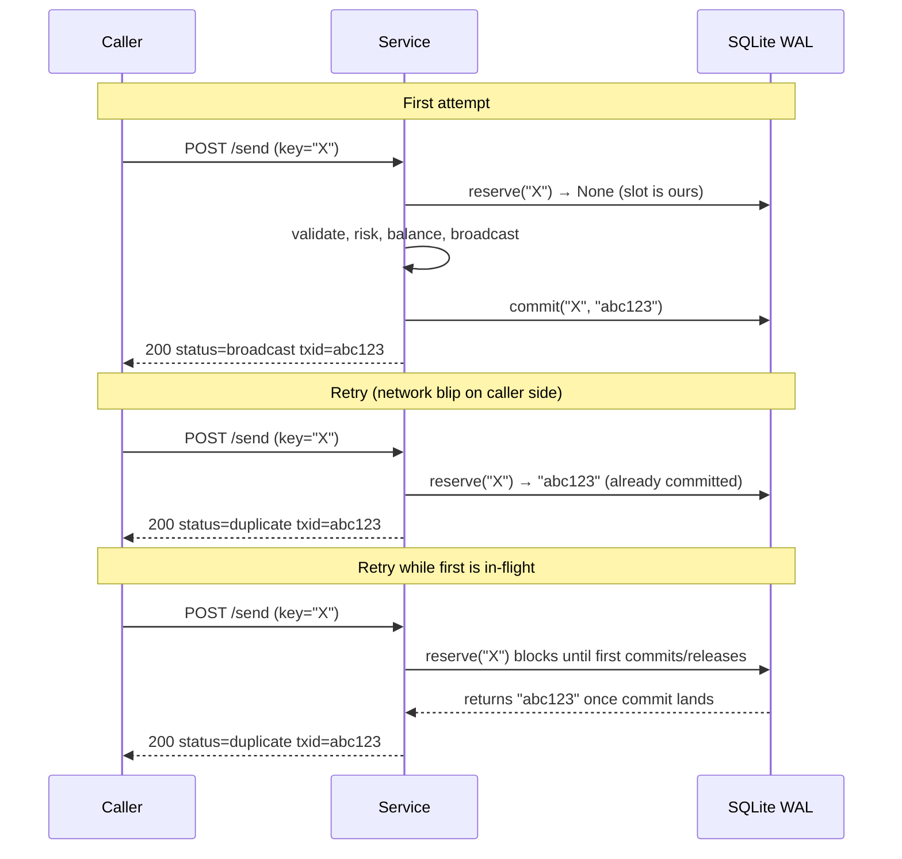

# HTTP API reference

All endpoints are mounted under `/api/v1/`. Authentication is the `X-API-Key` header. Only `/api/v1/health/live` and `/api/v1/version` are unauthenticated — everything else returns `401` without a valid key.

## Authentication

Two paths, depending on which token style your `.env` is configured for:

### Per-caller scoped tokens (1.5.0+, recommended)

Mint via `skr-crypto token create --name X --scope send,read`. The plaintext is shown once; verification is constant-time against scrypt-hashed records in the SQLite store.

Each token carries one or more **scopes**:

| Scope | Endpoints | Implies |
|---|---|---|
| `admin` | every endpoint | `send`, `read`, `metrics` |
| `send` | `POST /send` + read endpoints | `read` |
| `read` | `/balance`, `/wallets`, `/risk`, `/health` | — |
| `metrics` | `/metrics` only | — |

Per-route scope requirements:

| Endpoint | Required scope |
|---|---|
| `POST /api/v1/send` | `send` |
| `GET /api/v1/balance` | `read` |
| `GET /api/v1/wallets` | `read` |
| `GET /api/v1/risk/{addr}` | `read` |
| `GET /api/v1/health` | `read` |
| `GET /api/v1/metrics` | `metrics` (or wider) |

Scope failure returns **403 `INSUFFICIENT_SCOPE`** (distinct from 401):

```json
{
  "detail": {
    "error": "token requires scope 'send'; this token has ['read']",
    "code": "INSUFFICIENT_SCOPE",
    "required_scope": "send",
    "token_scopes": ["read"]
  }
}
```

Revocation is database-backed; a `skr-crypto token revoke <id>` call invalidates the token on the next request without restarting the service.

Token operations: see [`skr-crypto token`](commands/token.md).

Design rationale: [ADR 0008](adr/0008-per-caller-api-tokens.md).

### Legacy `AUTH_TOKEN` (1.0–1.4 compatibility)

If `AUTH_TOKEN` is set in `.env`, it works as a synthetic admin token (`token_id=legacy`). A deprecation warning is logged once at boot. To be removed in 2.0.

Existing single-token deployments continue working unchanged — the legacy path is a `hmac.compare_digest` short-circuit before the per-token store is consulted.

The base URL in examples below is `http://127.0.0.1:8000`. In production the service binds to localhost and a reverse proxy (Caddy / nginx / Cloudflare) terminates TLS in front.

## Conventions

- **JSON in, JSON out.** Pydantic-validated request bodies; responses are model-typed.
- **`X-Request-ID` echo.** Every response carries `X-Request-ID`. Clients can pass one in to thread their trace ID; we generate a 16-hex-char one if absent.
- **Rate limiting.** 30 req / 60 s per IP by default (`RATE_LIMIT_MAX` / `RATE_LIMIT_WINDOW`). Health endpoints and `/metrics` bypass.
- **Timeouts.** No server-side write timeout. The CLI uses 10 s default, 30 s for endpoints that hit TronGrid, 60 s for `/wallets` (which scales with N).
- **Error shape.** All 4xx/5xx responses are `{"error": "...", "code": "...", ...extra...}`. Codes are stable strings; the human `error` is for logs.

## Endpoint summary

| Method | Path | Auth | Purpose |
|---|---|---|---|
| GET | `/api/v1/health/live` | ❌ | Liveness — uptime + status, no RPC |
| GET | `/api/v1/version` | ❌ | Build info — git sha, network, started_at |
| GET | `/api/v1/health` | ✅ | Readiness — node connection + wallet count |
| GET | `/api/v1/balance` | ✅ | Treasury balances + on-chain resources |
| GET | `/api/v1/wallets` | ✅ | List every wallet with live balances |
| GET | `/api/v1/risk/{address}` | ✅ | Recipient risk report |
| POST | `/api/v1/send` | ✅ | Send USDT TRC-20 |
| GET | `/api/v1/metrics` | ✅ | Prometheus exposition |

---

## `GET /api/v1/health/live`

Cheap liveness probe. No external calls. Polled aggressively by k8s/load balancers; always returns fast.

**Request:**
```bash
curl http://127.0.0.1:8000/api/v1/health/live
```

**Response 200:**
```json
{ "status": "ok", "uptime_seconds": 12345 }
```

This endpoint **does not** prove TronGrid reachability. For that, use `/api/v1/health` (authenticated).

---

## `GET /api/v1/version`

Build/version info. Unauthenticated so dashboards and deploy pipelines can poll it without carrying the API key.

**Request:**
```bash
curl http://127.0.0.1:8000/api/v1/version
```

**Response 200:**
```json
{
  "git_sha": "a1b2c3d4e5f6",
  "started_at": 1714493600.0,
  "network": "mainnet"
}
```

`git_sha` is captured at boot from `git rev-parse HEAD`, or `"unknown"` if the working tree isn't a git checkout (e.g. a Docker image built from a tarball).

---

## `GET /api/v1/health`

Authenticated readiness probe. Reports the TronGrid connection state and the loaded wallet pool.

**Request:**
```bash
curl -H "X-API-Key: $AUTH_TOKEN" http://127.0.0.1:8000/api/v1/health
```

**Response 200:**
```json
{
  "status": "ok",
  "network": "mainnet",
  "uptime_seconds": 12345,
  "shutdown_in_seconds": 580,
  "node_connected": true,
  "wallet_count": 2,
  "wallet_names": ["cold", "hot"]
}
```

Notably **does not** include per-wallet balances or resources (which wallet would they belong to?). For per-wallet detail see `/api/v1/balance` or `/api/v1/wallets`.

`shutdown_in_seconds` is non-zero only when `SHUTDOWN_TIMEOUT > 0` (i.e. local dev). In containers the timeout is set to ~1 year.

---

## `GET /api/v1/balance`

Single wallet's TRX balance, USDT balance, and on-chain resource summary.

**Query parameters:**

- `wallet` (optional, ≤ 64 chars) — wallet name. Omit for single-wallet auto-resolve / multi-wallet auto-pick by max USDT.

**Request — single wallet or auto-pick:**
```bash
curl -H "X-API-Key: $AUTH_TOKEN" \
  http://127.0.0.1:8000/api/v1/balance
```

**Request — explicit wallet:**
```bash
curl -H "X-API-Key: $AUTH_TOKEN" \
  "http://127.0.0.1:8000/api/v1/balance?wallet=cold"
```

**Response 200:**
```json
{
  "wallet": "cold",
  "address": "TColdxxxxxxxxxxxxxxxxxxxxxxxxxxxxxx",
  "trx": "85.21",
  "usdt": "12500.00",
  "energy_available": 6500,
  "bandwidth_free_available": 600,
  "bandwidth_paid_available": 0,
  "tron_power_staked": 1000
}
```

**Response 404 — unknown wallet name:**
```json
{
  "error": "Wallet 'ghost' not found. Available: cold, hot",
  "code": "WALLET_NOT_FOUND",
  "wallet": "ghost",
  "available": ["cold", "hot"]
}
```

**Response 503 — auto-pick failed:**
```json
{
  "error": "could not fetch USDT balance for any wallet",
  "code": "WALLET_AUTOPICK_FAILED"
}
```

---

## `GET /api/v1/wallets`

Lists every wallet in the pool with live balances. The `auto_pick` field is the wallet that would handle a `/send` with no explicit `wallet` parameter right now.

**Request:**
```bash
curl -H "X-API-Key: $AUTH_TOKEN" http://127.0.0.1:8000/api/v1/wallets
```

**Response 200 (multi-wallet):**
```json
{
  "wallets": [
    {
      "wallet": "cold",
      "address": "TColdxxxxxxxxxxxxxxxxxxxxxxxxxxxxxx",
      "trx": "85.21",
      "usdt": "12500.00",
      "energy_available": 0,
      "bandwidth_free_available": 600,
      "bandwidth_paid_available": 0
    },
    {
      "wallet": "hot",
      "address": "THotxxxxxxxxxxxxxxxxxxxxxxxxxxxxxx",
      "trx": "41.00",
      "usdt": "250.00",
      "energy_available": 6500,
      "bandwidth_free_available": 600,
      "bandwidth_paid_available": 0
    }
  ],
  "auto_pick": "cold"
}
```

**Per-wallet RPC failures don't 5xx the whole listing.** A wallet whose lookup failed shows `"trx": "error"` and `"usdt": "error"` and is excluded from `auto_pick` selection.

**Cost:** 3 TronGrid RPCs per wallet (TRX balance, USDT balance, account resource). Generous timeout (60 s on the CLI side).

---

## `GET /api/v1/risk/{address}`

Recipient-risk report for an address. Read-only — never broadcasts. Same logic the `/send` preflight uses.

**Path parameters:**

- `address` — 34-char base58check TRON address (T...)

**Query parameters:**

- `external` (`true`/`false`, default `false`) — if `true`, also queries the TronScan reputation API (~+300ms). Independent of the server's `RISK_USE_EXTERNAL` setting.

**Request:**
```bash
curl -H "X-API-Key: $AUTH_TOKEN" \
  "http://127.0.0.1:8000/api/v1/risk/TRX9SbJzPbXYK1yw6VaFhCJ7ZKAoGwEPwy?external=true"
```

**Response 200:**
```json
{
  "address": "TRX9SbJzPbXYK1yw6VaFhCJ7ZKAoGwEPwy",
  "level": "low",
  "checks": [
    {"name": "validity",         "status": "ok",   "message": "valid base58check, 21 bytes, prefix 0x41", "severity": "info"},
    {"name": "burn_address",     "status": "ok",   "message": "not in known-burn list",                   "severity": "info"},
    {"name": "activation",       "status": "ok",   "message": "account activated",                        "severity": "info"},
    {"name": "smart_contract",   "status": "ok",   "message": "EOA (not a contract)",                     "severity": "info"},
    {"name": "usdt_blacklist",   "status": "ok",   "message": "not on Tether blacklist",                  "severity": "info"},
    {"name": "sanctions",        "status": "ok",   "message": "not on OFAC SDN list",                     "severity": "info"},
    {"name": "external_tronscan","status": "ok",   "message": "TronScan reputation: clean",               "severity": "info"},
    {"name": "external_misttrack","status":"skip", "message": "MistTrack key not configured",             "severity": "info"}
  ]
}
```

**`level`** is the worst-severity verdict across all checks. Values: `low` / `medium` / `high` / `invalid`.

**`status`** per check: `ok` (passed), `warn` (advisory), `fail` (would block at the right block-level), `skip` (couldn't run / not configured).

The `/send` endpoint uses the same logic but blocks at `RISK_BLOCK_LEVEL` (default `high`). See [Risk preflight](risk-preflight.md) for the full check matrix.

---

## `POST /api/v1/send`

Send USDT TRC-20. The big one.

**Request body:**
```json
{
  "to_address": "TRX9SbJzPbXYK1yw6VaFhCJ7ZKAoGwEPwy",
  "amount": "245.50",
  "idempotency_key": "invoice-2026-04-30-#741",
  "wallet": "cold"
}
```

| Field | Type | Constraints | Purpose |
|---|---|---|---|
| `to_address` | string | exactly 34 chars, T-prefixed base58check | recipient |
| `amount` | string/number → Decimal | > 0, ≤ 6 decimal places | USDT amount |
| `idempotency_key` | string | 1–128 chars | replay-protection key |
| `wallet` | string | optional, ≤ 64 chars | source wallet name (auto-pick if omitted) |

**Response 200 — broadcast:**
```json
{
  "txid": "abcdef0123456789...",
  "from_address": "TColdxxxxxxxxxxxxxxxxxxxxxxxxxxxxxx",
  "wallet": "cold",
  "to_address": "TRX9SbJzPbXYK1yw6VaFhCJ7ZKAoGwEPwy",
  "amount": "245.50",
  "idempotency_key": "invoice-2026-04-30-#741",
  "status": "broadcast"
}
```

**Response 200 — duplicate (same idempotency key, prior commit):**
```json
{
  "txid": "abcdef0123456789...",
  "from_address": "TColdxxxxxxxxxxxxxxxxxxxxxxxxxxxxxx",
  "wallet": "cold",
  "to_address": "TRX9SbJzPbXYK1yw6VaFhCJ7ZKAoGwEPwy",
  "amount": "245.50",
  "idempotency_key": "invoice-2026-04-30-#741",
  "status": "duplicate"
}
```

`status` is the only difference between the two cases. `txid` is identical to the original broadcast's.

**Error responses:**

| Status | Code | Meaning |
|---|---|---|
| 400 | `INVALID_ADDRESS` | `to_address` is not a valid TRON base58check |
| 400 | `INSUFFICIENT_BALANCE` | wallet's USDT < amount, or TRX < `MIN_TRX_RESERVE` |
| 400 | `ENERGY_TOO_EXPENSIVE` | estimated burn > `MAX_ENERGY_BURN_TRX` (stake or rent energy) |
| 400 | `RISK_TOO_HIGH` | recipient verdict ≥ `RISK_BLOCK_LEVEL`. Body includes full report. |
| 401 | — | missing or invalid `X-API-Key` |
| 401 | — | `Token has been revoked` (1.5.0+) |
| 403 | `INSUFFICIENT_SCOPE` | token valid but lacks `send` scope (1.5.0+) |
| 404 | `WALLET_NOT_FOUND` | `wallet` field doesn't match any pool entry |
| 409 | `IDEMPOTENCY_CONFLICT` | another request with this key is in flight |
| 409 | `IDEMPOTENCY_UNRESOLVED` | crashed prior run left this key in `UNKNOWN` state — manual reconcile required |
| 429 | `RATE_LIMIT_EXCEEDED` | per-IP rate limit hit |
| 500 | `TX_FAILED` | broadcast itself failed (node down, signature rejected) |
| 500 | `AUDIT_WRITE_FAILED` | durable audit write failed mid-request — DO NOT retry without reconciling |
| 503 | `WALLET_POOL_EMPTY` | service has zero wallets configured |
| 503 | `WALLET_AUTOPICK_FAILED` | every wallet's balance lookup failed during auto-pick |

**Example — risk-blocked recipient:**

Request:
```bash
curl -X POST http://127.0.0.1:8000/api/v1/send \
  -H "X-API-Key: $AUTH_TOKEN" -H "Content-Type: application/json" \
  -d '{
    "to_address": "TRsanctionedxxxxxxxxxxxxxxxxxxxxxx",
    "amount": "100",
    "idempotency_key": "test-1"
  }'
```

Response 400:
```json
{
  "error": "Recipient risk HIGH — refusing to broadcast. Failed: sanctions",
  "code": "RISK_TOO_HIGH",
  "level": "high",
  "report": {
    "address": "TRsanctioned...",
    "level": "high",
    "checks": [
      {"name": "sanctions", "status": "fail", "message": "address on OFAC SDN list", "severity": "high"},
      ...
    ]
  }
}
```

---

## `GET /api/v1/metrics`

Prometheus text exposition. Same authentication as everything else — scrapers must carry the API key.

**Request:**
```bash
curl -H "X-API-Key: $AUTH_TOKEN" http://127.0.0.1:8000/api/v1/metrics
```

**Response 200 (excerpt):**
```text
# HELP skr_crypto_uptime_seconds Process uptime
# TYPE skr_crypto_uptime_seconds gauge
skr_crypto_uptime_seconds 12345.0

# HELP skr_crypto_tx_broadcast_total USDT TRC-20 transfers attempted
# TYPE skr_crypto_tx_broadcast_total counter
skr_crypto_tx_broadcast_total{result="success"} 142.0
skr_crypto_tx_broadcast_total{result="failed"} 3.0

# HELP skr_crypto_tx_rejected_total Transfers refused before broadcast
# TYPE skr_crypto_tx_rejected_total counter
skr_crypto_tx_rejected_total{reason="insufficient_usdt"} 0.0
skr_crypto_tx_rejected_total{reason="risk_too_high"} 4.0
skr_crypto_tx_rejected_total{reason="energy_too_expensive"} 1.0
...
```

The `/metrics` scrape itself does **no** TronGrid RPCs — gauges are refreshed by the normal `/balance` / `/health` / `/send` paths. See [Monitoring & metrics](monitoring.md) for the full metric catalogue.

---

## Idempotency: complete flow



If the service crashes between `reserve` and `commit`, the slot is left in `PENDING`. At next boot, `idempotency.promote_orphans_to_unknown()` flips them all to `UNKNOWN`. A retry on a key in `UNKNOWN` returns:

```http
HTTP/1.1 409 Conflict
{
  "error": "Idempotency key 'X' is in UNKNOWN state ...",
  "code": "IDEMPOTENCY_UNRESOLVED",
  "idempotency_key": "X",
  "created_at": "2026-04-30T07:42:13Z"
}
```

The operator must check TronScan for the txid (or accept the loss) and either delete the key from the DB (`skr-crypto reconcile`) or use a new key. Full details: [Idempotency](idempotency.md).

---

## Stable error codes

The `code` field is the contract. It's stable across minor versions; values added in newer versions are documented in the changelog.

| Code | Class | First introduced |
|---|---|---|
| `INVALID_ADDRESS` | 400 | 1.0.0 |
| `INSUFFICIENT_BALANCE` | 400 | 1.0.0 |
| `ENERGY_TOO_EXPENSIVE` | 400 | 1.1.0 |
| `RISK_TOO_HIGH` | 400 | 1.2.0 |
| `WALLET_NOT_FOUND` | 404 | 1.4.0 |
| `IDEMPOTENCY_CONFLICT` | 409 | 1.0.0 |
| `IDEMPOTENCY_UNRESOLVED` | 409 | 1.1.0 |
| `RATE_LIMIT_EXCEEDED` | 429 | 1.0.0 |
| `TX_FAILED` | 500 | 1.0.0 |
| `AUDIT_WRITE_FAILED` | 500 | 1.1.0 |
| `WALLET_POOL_EMPTY` | 503 | 1.4.0 |
| `WALLET_AUTOPICK_FAILED` | 503 | 1.4.0 |
| `INSUFFICIENT_SCOPE` | 403 | 1.5.0 |
| `PAYOUT_ERROR` | 500 | (catch-all parent — should never appear if the service is correct) |

The CLI maps these to stable exit codes (`skr_crypto/cli/exceptions.py`).

---

## See also

- [Multi-wallet pool](multi-wallet.md) — how `wallet=` resolves
- [Risk preflight](risk-preflight.md) — what each check does
- [Idempotency](idempotency.md) — full state machine
- [Monitoring & metrics](monitoring.md) — every metric, every label
