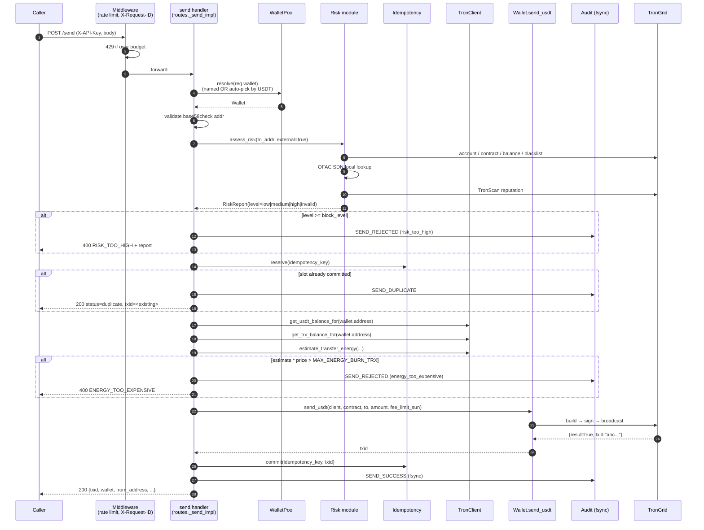
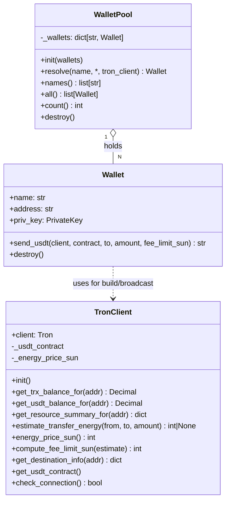
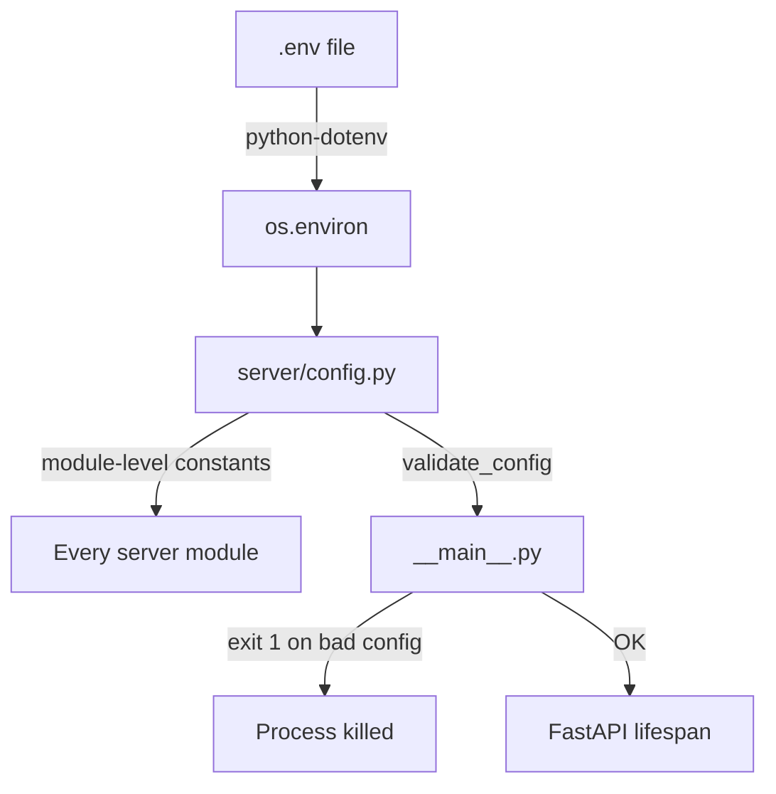
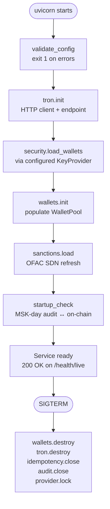
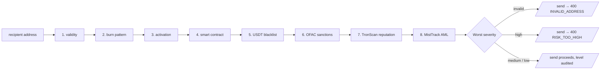
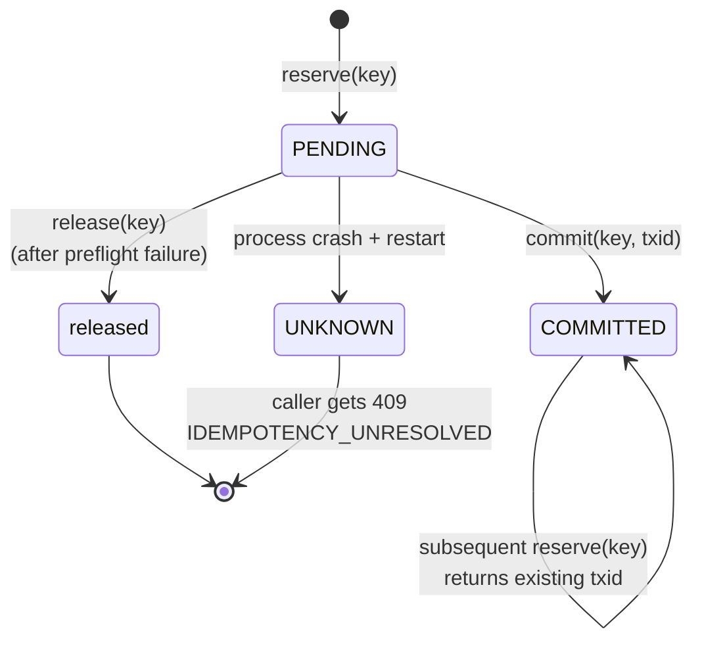

# Architecture

This document explains what every module in `skr_crypto/` does, how they fit together, and **why** each non-obvious shape was chosen. It's the document you should read before changing anything.

## Top-level layout

```text
skr_crypto/
├── version.py              # Single source of truth for the package version
├── cli/                    # Operator CLI (Click) — read-only on the money path
│   ├── main.py             # Click root group + lazy command registration
│   ├── api.py              # APIClient — HTTP wrapper around /api/v1
│   ├── commands/           # One module per command, lazy-imported
│   │   ├── install.py      # Interactive wizard
│   │   ├── wallet.py       # `wallet list/add/generate/remove/encrypt/...`
│   │   ├── balance.py      # `balance --wallet`
│   │   ├── risk.py         # `risk <addr>`
│   │   ├── audit.py        # `audit | tail`
│   │   ├── reconcile.py    # MSK-day reconciliation
│   │   └── ...             # 14 more
│   ├── config.py           # .env parsing + install-dir resolution
│   ├── exceptions.py       # ClickException subclasses with stable exit codes
│   └── output.py           # Rich-based renderers (tables, colours)
└── server/                 # FastAPI service — the only code path that signs
    ├── __main__.py         # uvicorn entry point
    ├── server.py           # App factory + lifespan + middleware + handlers
    ├── routes.py           # /api/v1/* — every endpoint
    ├── models.py           # Pydantic schemas
    ├── exceptions.py       # PayoutError tree
    ├── tron_client.py      # Keyless TRON RPC layer
    ├── wallet.py           # Wallet (name + address + PrivateKey + send_usdt)
    ├── wallet_pool.py      # WalletPool with auto-pick by max USDT
    ├── key_providers.py    # 5 backends → list[LoadedWallet]
    ├── encrypted_keystore.py   # AES-256-GCM JSON keystore
    ├── security.py         # Bridges providers → WalletPool, X-API-Key auth
    ├── risk.py             # 8-check recipient risk preflight
    ├── sanctions.py        # OFAC SDN list manager (local, zero-rate-limit)
    ├── idempotency.py      # State machine + SQLite WAL store
    ├── audit.py            # Append-only JSON audit with fsync
    ├── metrics.py          # Prometheus counters / histograms / gauges
    ├── startup_check.py    # MSK-day audit ↔ on-chain reconciliation
    ├── shutdown.py         # Inactivity-driven auto-shutdown
    ├── net.py              # X-Forwarded-For-aware client_address
    ├── logging_config.py   # JSON or human-text logging selector
    └── config.py           # Env-driven configuration + validation
```

7,000-ish lines. ~3,500 tests. The line count is on purpose.

---

## Request lifecycle: `POST /api/v1/send`



The `_send_lock` (process-wide `threading.Lock`) is acquired at step 4 and released after step 21. Concurrent /send requests queue. This is intentional — see [ADR 0001](adr/0001-sync-only-architecture.md).

---

## The keyless TronClient + Wallet split

Until 1.3.x, `tron` was a singleton holding the HTTP client **and** the private key. Multi-wallet broke that — there are now N keys per process, but only one HTTP connection pool. So 1.4.0 split the model:



**Invariants:**

- `TronClient` never sees a `PrivateKey`. Anything that signs is in `Wallet.send_usdt`.
- `WalletPool` is the only place that maps a `name` → `Wallet`.
- Endpoints **never** read `tron.address` or hold a wallet reference between requests.

This makes the blast radius of any signing-related change one file: `wallet.py`.

---

## Configuration is env-driven, validated at boot



`config.py` reads everything at import time and exposes module-level constants. `validate_config()` runs in `__main__` before uvicorn starts and `sys.exit(1)`s on invalid combinations (e.g. `KEY_PROVIDER=encrypted_file` without `KEYSTORE_FILE`).

Tests reload `config.py` after monkeypatching env vars — see `tests/conftest.py`'s pre-import dance for why dotenv has to be neutralised.

---

## Lifespan: what runs at boot, in order



**Why the order matters:**

- Wallet pool must be populated before any /send arrives. The pool is checked by every wallet-resolving endpoint.
- Sanctions list refresh is **best-effort**. A network failure logs a warning and continues — the on-disk cache is the fallback (see [ADR 0002](adr/0002-pluggable-key-providers.md) for the same pattern with key providers).
- The MSK reconciliation is **best-effort** too — see [ADR 0003](adr/0003-msk-day-reconciliation.md). It compares yesterday's `SEND_SUCCESS` audit records against on-chain receipts.
- Shutdown is reversed: wallets first (so we stop being able to sign), then connections, then storage, then the secret store.

---

## Three storage layers, three durability stories

| Storage | Used for | Durability | Recovery |
|---|---|---|---|
| **Audit log** (`audit.log`) | Compliance trail of every SEND_* event | Append-only, fsync per record, hard-error on write fail (5xx) | Re-run `startup_check`; manual reconciliation with TronScan |
| **Idempotency DB** (`idempotency.db`) | Replay protection across restarts | SQLite WAL, fsync on commit | Orphaned PENDING rows promoted to UNKNOWN at boot → caller sees `IDEMPOTENCY_UNRESOLVED` 409 |
| **Sanctions cache** (`ofac-sdn-trx.txt`) | OFAC list when offline | Plain file overwritten on each successful refresh | None needed — list is reloaded on next boot |

The audit log and idempotency DB are the only files you must back up. Lose them and you lose the ability to detect double-broadcasts.

---

## Risk preflight, in detail

The risk module runs eight checks in order, returning the worst severity:



Checks 1–6 are **always on** and have no rate limit. Checks 7–8 are external HTTP calls, gated by `RISK_USE_EXTERNAL` (default true) and `MISTTRACK_API_KEY` respectively.

A single failed check doesn't always block — only `FAIL` at or above `RISK_BLOCK_LEVEL` does. The full machinery: [Risk preflight](risk-preflight.md).

---

## Idempotency state machine



A key in `UNKNOWN` is **dangerous**: we don't know if its broadcast happened. The service refuses retries — the operator must reconcile manually (TronScan + audit log) before sending again with the same key. Full details: [Idempotency](idempotency.md).

---

## Operator CLI vs the service

The CLI is a **read-only client of the API** plus an **install-time keystore manager**. There is no `skr-crypto send` command. There never will be. Money moves through the authenticated HTTP API only — see [Security model](security.md) for why.

Two commands write to disk:

- `skr-crypto install` — wizard, writes `.env` (chmod 600) and `data/`.
- `skr-crypto wallet ...` — for `KEY_PROVIDER=encrypted_file`, writes to the keystore JSON. For other providers, prints the env-var / file layout to apply manually.

Every other command either reads the local `.env`, hits `/api/v1/...`, or shells out to systemd / docker.

---

## Tested invariants

The test suite (~390 tests) enforces the invariants that make this thing trustworthy:

- **No HTTP escapes the test process.** Tests that forget to mock fail loud (connection refused). `tests/conftest.py` neutralises dotenv before any server import so a stray prod `.env` can't leak in.
- **Audit fsync failure is a 5xx.** `test_audit.py::test_audit_write_failure_returns_500`.
- **Empty/missing txid never gets cached as success.** `test_tron_client.py::TestSendUsdtBroadcastResult::test_empty_txid_raises`.
- **Idempotency survives a crash.** `test_idempotency.py::test_orphaned_pending_promoted_to_unknown`.
- **OFAC blocks /send.** `test_routes_risk.py::test_sanctioned_address_blocked`.
- **Multi-wallet auto-pick uses max USDT.** `test_wallet_pool.py::test_auto_pick_returns_max_usdt`.

If you change something and one of these flips, the change is wrong — not the test.

---

## What this codebase deliberately does NOT do

- **No async on the money path.** [ADR 0001](adr/0001-sync-only-architecture.md).
- **No webhooks.** Callers poll `check-tx` or watch their own ledger. Webhooks add a delivery-guarantee surface we don't want.
- **No per-customer accounting.** The service moves money; your back-office tracks who's owed what.
- **No second TRC-20 token by default.** `USDT_CONTRACT` is configurable, but only one token per process.
- **No multi-currency.** TRX-based USDT only.
- **No queue / batch endpoint.** Each /send is one transfer. Batching would obscure the audit trail and complicate idempotency.
- **No "soft" audit failure.** [ADR 0004](adr/0004-audit-hard-error.md).

These are not features waiting to be added. They are explicit non-goals. Every one of them came up at least once and was rejected with a paragraph of reasoning that lives somewhere in this repo.
