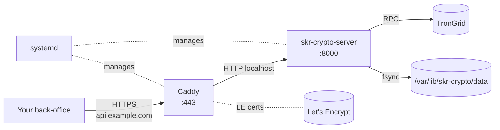

# VPS + systemd

The "boring, single-host, production" deploy. A small VPS (Hetzner CX22, DigitalOcean $6, Vultr $6 — anything with 1 GB RAM and a public IPv4 works), Caddy as the reverse proxy, systemd unit with hardening, unattended-upgrades for the OS.

This is the right path when:

- You want a single owner host you SSH into.
- You don't already run an orchestrator (k8s/Nomad).
- Per-month cost matters (€5/month vs $50/month managed container platforms).
- You like reading actual log files.

For the orchestrated container path, see [Docker](docker.md).

---

## Architecture



- **Caddy** terminates TLS, gets certs from Let's Encrypt automatically, reverse-proxies to the service on `127.0.0.1:8000`.
- **systemd** keeps both processes alive, restarts on failure, manages logs via journald.
- **The service** binds only to `127.0.0.1:8000` — never reachable from outside without going through Caddy.

---

## Initial host setup

A fresh Debian/Ubuntu LTS:

```bash
# As root or via sudo
apt update && apt upgrade -y
apt install -y python3.12 python3.12-venv git curl ufw unattended-upgrades

# Lock down the firewall — SSH + HTTPS only.
ufw default deny incoming
ufw default allow outgoing
ufw allow 22/tcp
ufw allow 80/tcp           # for ACME HTTP-01 challenge
ufw allow 443/tcp
ufw enable

# Auto-apply security upgrades.
dpkg-reconfigure -p high unattended-upgrades

# Service user.
useradd -r -s /bin/false -d /var/lib/skr-crypto -m skr
```

---

## Install the service

```bash
# As skr (or your admin user, then chown -R)
sudo -u skr -H bash <<'EOF'
cd /var/lib/skr-crypto
python3.12 -m venv venv
source venv/bin/activate

# Install from a tagged release wheel (preferred for production).
LATEST=$(curl -s https://api.github.com/repos/vampir15551/skr-crypto/releases/latest | jq -r .tag_name)
pip install "https://github.com/vampir15551/skr-crypto/releases/download/${LATEST}/skr_crypto-${LATEST#v}-py3-none-any.whl[server]"

# OR install from a git checkout for development:
# git clone https://github.com/vampir15551/skr-crypto.git src
# pip install -e "./src[server]"

# Configure
skr-crypto install --dir /var/lib/skr-crypto
EOF
```

The wizard asks the same questions as the Mac flow. Pick `KEY_PROVIDER=encrypted_file` for the multi-wallet, encrypted-at-rest path. The wizard writes:

```text
/var/lib/skr-crypto/
├── .env                          chmod 600
└── data/                         chmod 700
    ├── keystore.json             (after `wallet encrypt`)
    ├── audit.log                 (created on first /send)
    └── idempotency.db            (created on first reserve)
```

Initialise the keystore + add a wallet:

```bash
sudo -u skr -H /var/lib/skr-crypto/venv/bin/skr-crypto wallet encrypt \
    -o /var/lib/skr-crypto/data/keystore.json
sudo -u skr -H /var/lib/skr-crypto/venv/bin/skr-crypto wallet generate main
```

---

## The systemd unit

`/etc/systemd/system/skr-crypto.service`:

```ini
[Unit]
Description=SKR Crypto USDT TRC-20 treasury
Documentation=https://vampir15551.github.io/skr-crypto/
After=network-online.target
Wants=network-online.target

[Service]
Type=exec
User=skr
Group=skr
WorkingDirectory=/var/lib/skr-crypto
EnvironmentFile=/var/lib/skr-crypto/.env
ExecStart=/var/lib/skr-crypto/venv/bin/skr-crypto-server
Restart=on-failure
RestartSec=5s

# --- Hardening ---
# Mount /, /usr, /etc as read-only (the service writes only to data/).
ProtectSystem=strict
ReadWritePaths=/var/lib/skr-crypto/data
ProtectHome=true

# Drop unnecessary capabilities. The service does no privileged ops.
CapabilityBoundingSet=
AmbientCapabilities=
NoNewPrivileges=true

# Block process namespace + kernel APIs we don't need.
ProtectKernelTunables=true
ProtectKernelModules=true
ProtectKernelLogs=true
ProtectControlGroups=true
ProtectClock=true
ProtectHostname=true
RestrictRealtime=true
RestrictSUIDSGID=true
LockPersonality=true
RestrictNamespaces=true
PrivateTmp=true
PrivateDevices=true

# Network — outbound only, no listen on anything but the bound port.
RestrictAddressFamilies=AF_INET AF_INET6 AF_UNIX

# Memory hygiene.
MemoryDenyWriteExecute=true
SystemCallFilter=@system-service
SystemCallErrorNumber=EPERM
SystemCallArchitectures=native

# Fall over loudly.
StandardOutput=journal
StandardError=journal

# Resource limits.
LimitNOFILE=4096
TasksMax=64

[Install]
WantedBy=multi-user.target
```

The hardening directives are not optional — they limit blast radius if the service is ever compromised. `systemd-analyze security skr-crypto` should report a score around 1.0–1.5 (lower is more locked down).

The passphrase: **don't put it in `.env` if you can avoid it.** Better:

```bash
# Mount the passphrase as a separate read-only file owned by root
# (skr can read but not write it).
echo "your-passphrase-here" > /etc/skr-crypto/keystore.pass
chown root:skr /etc/skr-crypto/keystore.pass
chmod 640 /etc/skr-crypto/keystore.pass
```

```ini
# In .env
KEY_PASSPHRASE_FILE=/etc/skr-crypto/keystore.pass
```

```ini
# Add to the systemd unit
ReadOnlyPaths=/etc/skr-crypto
```

This way the passphrase file is isolated from the service's writable volume, and a compromise of the data dir doesn't expose it.

---

## Enable + start

```bash
systemctl daemon-reload
systemctl enable --now skr-crypto

# Verify
systemctl status skr-crypto
journalctl -u skr-crypto -f
curl http://127.0.0.1:8000/api/v1/health/live
```

---

## Caddy in front

Install Caddy:

```bash
apt install -y debian-keyring debian-archive-keyring apt-transport-https
curl -1sLf 'https://dl.cloudsmith.io/public/caddy/stable/gpg.key' | tee /etc/apt/trusted.gpg.d/caddy-stable.asc
curl -1sLf 'https://dl.cloudsmith.io/public/caddy/stable/debian.deb.txt' | tee /etc/apt/sources.list.d/caddy-stable.list
apt update
apt install -y caddy
```

`/etc/caddy/Caddyfile`:

```caddyfile
{
    # email used for ACME registration / cert renewal
    email ops@example.com
}

api.example.com {
    # ACME HTTP-01 over port 80, then HTTPS on 443. Caddy handles renewal.

    # Optional: restrict by source IP if your callers are known.
    @allowed remote_ip 203.0.113.10/32 198.51.100.0/24
    handle @allowed {
        reverse_proxy 127.0.0.1:8000
    }
    handle {
        respond 403
    }

    # Or just open it up + rely on AUTH_TOKEN:
    # reverse_proxy 127.0.0.1:8000

    # Common security headers.
    header {
        Strict-Transport-Security "max-age=31536000; includeSubDomains"
        X-Content-Type-Options "nosniff"
        Referrer-Policy "no-referrer"
        # Don't leak the upstream
        -Server
    }

    # Body size cap — /send bodies are tiny, deny large uploads.
    request_body {
        max_size 10kb
    }

    # Logs to journal.
    log {
        output stdout
        format json
    }
}
```

```bash
systemctl enable --now caddy
caddy validate --config /etc/caddy/Caddyfile
systemctl reload caddy
```

DNS: point `api.example.com` to your VPS IP. Caddy provisions Let's Encrypt certs automatically on first request.

**Set `TRUSTED_PROXIES=127.0.0.1` in `.env`** so the rate limiter sees the real client IP from `X-Forwarded-For` instead of treating Caddy itself as the source.

```bash
systemctl restart skr-crypto
```

---

## Verifying end-to-end

```bash
# From outside
curl https://api.example.com/api/v1/health/live
# {"status":"ok",...}

# Auth-required endpoint
curl -H "X-API-Key: $AUTH_TOKEN" https://api.example.com/api/v1/balance
# {"wallet":"main",...}
```

If you see `403` from Caddy, your IP isn't in the allow list. If you see `401`, the auth token is wrong. If you see `502`, Caddy can't reach the service — check `journalctl -u skr-crypto`.

---

## Operations

```bash
# Service control
systemctl status skr-crypto
systemctl restart skr-crypto
systemctl stop skr-crypto

# Logs (operational)
journalctl -u skr-crypto -f                          # tail
journalctl -u skr-crypto --since '1h ago'            # last hour
journalctl -u skr-crypto -p warning                  # warnings + above

# Logs (audit — separate, durable file)
tail -f /var/lib/skr-crypto/data/audit.log | jq .
sudo -u skr -H /var/lib/skr-crypto/venv/bin/skr-crypto audit --tail 50

# Wallet management (passphrase via the file you created)
sudo -u skr -H \
  KEY_PASSPHRASE_FILE=/etc/skr-crypto/keystore.pass \
  /var/lib/skr-crypto/venv/bin/skr-crypto wallet generate cold
systemctl restart skr-crypto

# Backups
sudo -u skr -H /var/lib/skr-crypto/venv/bin/skr-crypto backup
ls /var/lib/skr-crypto/data/backup-*.tar.gz
# Pull off-host immediately — leaving backups on the same disk is no backup.
```

---

## Updates

```bash
# Stop the service
systemctl stop skr-crypto

# Update the wheel
LATEST=$(curl -s https://api.github.com/repos/vampir15551/skr-crypto/releases/latest | jq -r .tag_name)
sudo -u skr -H /var/lib/skr-crypto/venv/bin/pip install --upgrade \
    "https://github.com/vampir15551/skr-crypto/releases/download/${LATEST}/skr_crypto-${LATEST#v}-py3-none-any.whl[server]"

# Inspect the changelog before restarting — major versions break wire compat
less /var/lib/skr-crypto/venv/lib/python3.12/site-packages/skr_crypto*.dist-info/METADATA

# Restart
systemctl start skr-crypto
journalctl -u skr-crypto -f
```

For one-line update with rollback safety, the CLI ships `skr-crypto update`:

```bash
sudo -u skr -H /var/lib/skr-crypto/venv/bin/skr-crypto update
# Snapshots the venv, pip-installs latest, runs `skr-crypto doctor`,
# rolls back on any check failure.
```

---

## Backup automation

Cron daily, off-host weekly:

```bash
# /etc/cron.daily/skr-crypto-backup
#!/bin/sh
set -e
sudo -u skr -H /var/lib/skr-crypto/venv/bin/skr-crypto backup
# Keep on-host for 7 days
find /var/lib/skr-crypto/data -name 'backup-*.tar.gz' -mtime +7 -delete
```

```bash
# /etc/cron.weekly/skr-crypto-offsite
#!/bin/sh
set -e
LATEST=$(ls -t /var/lib/skr-crypto/data/backup-*.tar.gz | head -1)
rsync -av "$LATEST" backup-host:/backups/skr-crypto/
```

---

## Hardening checklist

- [ ] `ufw` enabled, only 22/80/443 inbound.
- [ ] SSH `PermitRootLogin no`, key-only auth, fail2ban for brute-force protection.
- [ ] `unattended-upgrades` enabled with security pocket.
- [ ] `skr` user has `/bin/false` shell, no sudo rights.
- [ ] `.env` chmod 600, owned by `skr:skr`.
- [ ] `keystore.json` chmod 600, owned by `skr:skr`.
- [ ] `keystore.pass` chmod 640, owned by `root:skr` (skr reads, only root writes).
- [ ] Caddy has IP allow list **OR** AUTH_TOKEN is generated with `openssl rand -hex 32` (never a memorable string).
- [ ] `TRUSTED_PROXIES=127.0.0.1` so the rate limiter sees real client IPs.
- [ ] Backup off-host weekly, verified by attempting a restore in a sandbox.
- [ ] `systemd-analyze security skr-crypto` score < 2.0.

---

## See also

- [Local on Mac](local-mac.md) — the dev counterpart of this setup
- [Docker](docker.md) — containerised alternative
- [Security model](../security.md) — threat model + what each gate buys you
- [Monitoring & metrics](../monitoring.md) — Prometheus integration
