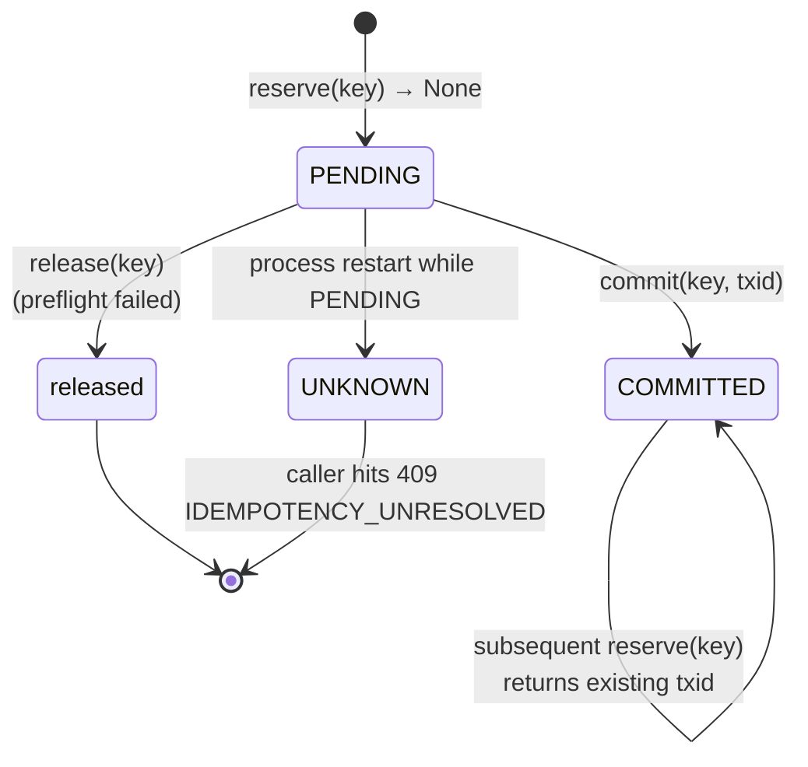

# Idempotency

Replay protection that survives **process crashes**. Without this, a network blip between caller and service plus a retry equals a double-send.

Implementation: `skr_crypto/server/idempotency.py`. Backed by SQLite WAL when `IDEMPOTENCY_DB_PATH` is set, in-memory otherwise.

---

## The contract

Every `/send` carries a caller-chosen `idempotency_key` (1–128 chars). The service guarantees:

- **At most one broadcast per key.** Two requests with the same key never produce two on-chain transactions, no matter the timing.
- **Same response for the same key.** The second request gets the same `txid` as the first, with `status: "duplicate"`.
- **Survives restart.** Provided `IDEMPOTENCY_DB_PATH` is set, the guarantee holds across process crashes.

The caller picks keys. Recommended pattern: `{recipient_address}{MSK_date}{invoice_id}`. Unique per logical payment, easy to derive deterministically from your back-office state.

---

## State machine



| State | What it means | Next reserve returns |
|---|---|---|
| **PENDING** | Slot taken; broadcast not yet committed | blocks until commit/release/timeout |
| **COMMITTED** | Successfully broadcast; we know the txid | the existing txid (`status: duplicate`) |
| **released** | Broadcast aborted before commit (preflight failure, validation error) | next reserve treats it as new |
| **UNKNOWN** | A `PENDING` slot survived a process restart | 409 `IDEMPOTENCY_UNRESOLVED` — manual reconcile required |

---

## Walking through `reserve()`

```python
def reserve(self, key: str) -> str | None:
    """Atomically claim a slot for `key`.
       Returns:
         None      → slot is yours, you must commit() or release()
         "<txid>"  → already committed (duplicate path)
       Blocks if another request is in-flight; raises IdempotencyConflict
       on wait timeout, UnresolvedIdempotency on UNKNOWN slot.
    """
```

Concurrent semantics:

1. **First call** for a key — inserts a `PENDING` row, returns `None`. Caller must `commit()` or `release()` before the wait timeout (~30 s).
2. **Subsequent call** while first is `PENDING` — blocks until the first one resolves, then returns the appropriate value (`"<txid>"` if committed, raises if released).
3. **Subsequent call** after `COMMITTED` — returns the cached txid immediately. Cheap — no broadcast, no risk preflight, no balance check. Just a SQLite SELECT.
4. **Subsequent call** after a crash that left it `PENDING` → `UNKNOWN` → `UnresolvedIdempotency` raised → 409.

---

## Why SQLite + WAL

The idempotency store has exactly two needs:

1. **Atomic state transitions** under thread contention.
2. **Durability** across process crashes.

SQLite WAL gives us both with a single library that's already in CPython. WAL mode means readers don't block writers and vice versa, which matters because we hold the slot from `reserve()` through `commit()` (across multiple TronGrid RPCs).

Schema:

```sql
CREATE TABLE IF NOT EXISTS idempotency (
    key         TEXT PRIMARY KEY,
    state       TEXT NOT NULL CHECK (state IN ('PENDING','COMMITTED','UNKNOWN')),
    txid        TEXT,
    created_at  TEXT NOT NULL,
    updated_at  TEXT NOT NULL
);
CREATE INDEX idx_state ON idempotency(state);
```

`updated_at` is bumped on every state transition so we can age-out crashed-PENDING rows during boot.

---

## In-memory mode (when `IDEMPOTENCY_DB_PATH` is empty)

Dev / CI only. Identical state machine, but state lives in a `dict[str, _Slot]` protected by a `threading.RLock`. The catch: **state is lost on restart**. The service logs a loud warning at boot:

```
WARNING  payouts:idempotency.py:353 Idempotency store: IN-MEMORY (IDEMPOTENCY_DB_PATH unset) — state will NOT survive restart, retries across restart can double-broadcast. Set IDEMPOTENCY_DB_PATH for production.
```

Production deploys must set `IDEMPOTENCY_DB_PATH`. The install wizard does this by default (`data/idempotency.db`).

---

## The `UNKNOWN` state and why we refuse to retry

Imagine: caller hits `/send`, service reserves the slot (PENDING), starts the broadcast, the process is killed mid-broadcast (oom, sigterm, crash). Did the broadcast land?

- The **TronGrid endpoint** may or may not have received the signed transaction.
- The **on-chain state** may or may not have a txid for our signature.
- The **service** has no way to know without looking up the on-chain state.

Silently retrying is unsafe. If the original landed, the retry double-spends. If it didn't, the retry is correct. We can't tell from inside the process.

So at boot:

```python
def _promote_orphans_to_unknown(self) -> None:
    """Any PENDING row that's been around longer than _PENDING_GRACE_SEC
    is from a crashed prior run — promote to UNKNOWN."""
```

Then:

```python
def reserve(self, key: str) -> str | None:
    ...
    if state == "UNKNOWN":
        raise UnresolvedIdempotency(key, created_at=created_at)
```

The caller gets:

```http
HTTP/1.1 409 Conflict
{
  "error": "Idempotency key 'X' is in UNKNOWN state — manual reconcile required",
  "code": "IDEMPOTENCY_UNRESOLVED",
  "idempotency_key": "X",
  "created_at": "2026-04-30T07:42:13Z"
}
```

The operator's playbook:

1. **Check the audit log.** Look for `SEND_*` records around `created_at`. If you see `SEND_SUCCESS`, the broadcast landed.
2. **Check TronScan.** Search by recipient address + amount + the time window. If the transfer is on-chain, the broadcast landed.
3. **Resolve the slot.** Use `skr-crypto reconcile <key> --status committed --txid <txid>` if landed, or `... --status released` if not.
4. **Caller can retry** with the same key after resolution.

This is intentionally manual. A money-mover that auto-recovers from a "did the broadcast land?" question by guessing is a money-mover that occasionally double-sends.

---

## What `commit()` and `release()` actually do

```python
def commit(self, key: str, txid: str) -> None:
    """Replace PENDING with COMMITTED + the real txid.
       Atomic: either the row is updated or this raises."""

def release(self, key: str) -> None:
    """Free a PENDING slot without committing.
       No-op if the slot was already committed (defensive)."""
```

`release()` is called from the catch-all in `_send_impl`:

```python
try:
    txid = wallet.send_usdt(...)
    idempotency.commit(req.idempotency_key, txid)
except BaseException:
    idempotency.release(req.idempotency_key)
    raise
```

Any exception between reserve and commit drops the slot. The next retry sees a fresh slot. Importantly, **risk preflight failures release the slot** — the caller can fix their request and retry with the same key.

---

## Wait timeout

If the first request takes longer than the wait timeout (default 30 s) to commit/release, subsequent waiters get:

```http
HTTP/1.1 409 Conflict
{
  "error": "Idempotency conflict: key 'X' is still in flight",
  "code": "IDEMPOTENCY_CONFLICT"
}
```

This is rare in practice. The /send global lock and TronGrid RPC budget mean a single transfer takes ~1–3 s. Hitting the 30 s timeout means TronGrid is severely degraded and the operator should see related 5xx noise in metrics already.

The waiter that timed out doesn't know whether the in-flight one will eventually commit or fail. Best practice: don't auto-retry on `IDEMPOTENCY_CONFLICT`; surface to the operator and check audit + TronScan.

---

## How big does the DB get?

Each row is small (~150 bytes). At 1000 transfers/day, you accumulate ~50 MB/year. There's no automatic pruning — the store remembers every committed key forever, because that's what idempotency means.

For multi-year deploys with millions of keys, run `skr-crypto reconcile --gc-older-than 90d` periodically. (Not yet shipped; tracked as a future feature. For now, manually `DELETE` old `COMMITTED` rows older than your retention window.)

---

## Cookbook

### Generate idempotency keys deterministically

A common pattern:

```python
import hashlib

def idempotency_key(invoice_id: str, recipient: str, msk_date: str) -> str:
    raw = f"{invoice_id}|{recipient}|{msk_date}"
    return hashlib.sha256(raw.encode()).hexdigest()[:32]
```

Same logical payment → same key → at most one broadcast. Re-running your back-office's payment loop is safe.

### Test that retry → duplicate works

```bash
KEY="test-$(date +%s)"
# First call
curl -X POST http://127.0.0.1:8000/api/v1/send \
  -H "X-API-Key: $AUTH_TOKEN" -H "Content-Type: application/json" \
  -d "{\"to_address\":\"...\",\"amount\":\"1\",\"idempotency_key\":\"$KEY\"}"
# {"status":"broadcast","txid":"abc..."}

# Second call — same key
curl -X POST http://127.0.0.1:8000/api/v1/send \
  -H "X-API-Key: $AUTH_TOKEN" -H "Content-Type: application/json" \
  -d "{\"to_address\":\"...\",\"amount\":\"1\",\"idempotency_key\":\"$KEY\"}"
# {"status":"duplicate","txid":"abc..."}
```

Both responses have identical `txid`. Only one tx exists on-chain.

### Investigate an `IDEMPOTENCY_UNRESOLVED`

```bash
# 1. Find the audit record
skr-crypto audit | grep '"idempotency_key":"my-key"'

# 2. If you see SEND_SUCCESS with a txid, check TronScan
skr-crypto check-tx <txid>

# 3. Resolve the slot
skr-crypto reconcile my-key --status committed --txid <txid>
# or
skr-crypto reconcile my-key --status released
```

Future retries with `my-key` now work normally.

---

## Failure modes

| Symptom | Cause | Fix |
|---|---|---|
| `409 IDEMPOTENCY_UNRESOLVED` | Crashed prior run left this key in `UNKNOWN` | Reconcile manually (above) |
| `409 IDEMPOTENCY_CONFLICT` | First request to this key still in flight | Wait, then check audit + TronScan |
| Many `SEND_DUPLICATE` audit records | Caller is retrying aggressively | Investigate caller — usually an unbounded retry loop |
| All idempotency state lost on restart | `IDEMPOTENCY_DB_PATH` is empty (in-memory) | Set the path; restart |
| Idempotency DB file grew very large | High volume + no GC | `DELETE` old `COMMITTED` rows older than your retention window |

---

## See also

- [HTTP API: /send](api-reference.md#post-apiv1send) — request/response shape
- [Audit log](audit-log.md) — what gets recorded for each idempotency event
- [`reconcile` command](commands/diagnostics.md) — manual UNKNOWN-slot resolution
- [Architecture: storage layers](architecture.md#three-storage-layers-three-durability-stories) — why three separate persistence stories
