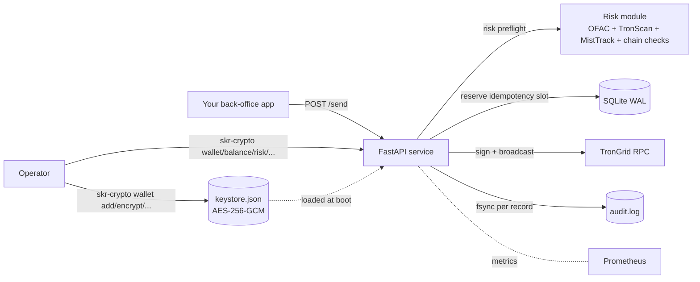

# SKR Crypto

A USDT TRC-20 treasury — a synchronous payouts service plus an operator CLI shipped as one Python package.

This is not a payment processor. It is a small, opinionated, single-binary service that:

- holds N TRON private keys (encrypted at rest, decrypted only in process memory),
- exposes a tiny authenticated HTTP API for sending USDT TRC-20 transfers,
- guarantees every transfer is **idempotent**, **audited**, **risk-checked**, and **sanctions-screened** before it ever hits the chain,
- runs on a laptop, a VPS, or a container with the same code path,
- and refuses to do anything else.

If you want a feature-rich payment platform with dashboards and webhooks, this is not it. If you want a 7,000-line piece of code that you can read in an afternoon and trust to move money — read on.

---

## What's actually here



You write the **caller**. We give you everything else.

---

## What it does in one minute

```bash
# 1. install + initialise an encrypted keystore
pip install 'skr-crypto[server]'
skr-crypto install                          # interactive wizard
skr-crypto wallet encrypt -o data/keystore.json
skr-crypto wallet generate main             # fresh TRON private key
skr-crypto start                            # service up on :8000

# 2. send USDT
curl -X POST http://127.0.0.1:8000/api/v1/send \
  -H "X-API-Key: $AUTH_TOKEN" -H "Content-Type: application/json" \
  -d '{
    "to_address": "TRX9SbJzPbXYK1yw6VaFhCJ7ZKAoGwEPwy",
    "amount": "245.50",
    "idempotency_key": "invoice-2026-04-30-#741"
  }'
# {"txid":"abcd…","wallet":"main","from_address":"T…","amount":"245.50",
#  "idempotency_key":"invoice-2026-04-30-#741","status":"broadcast"}

# 3. check what just happened
skr-crypto audit | tail -1
skr-crypto check-tx abcd…
```

A second `POST` with the same `idempotency_key` returns the **same** txid with `status: "duplicate"` — even across process restarts (idempotency state is on disk).

---

## Why this design

### One package, two binaries

```text
pip install skr-crypto[server]
├── skr-crypto         # operator CLI — install, status, balance, audit, wallet, ...
└── skr-crypto-server  # the FastAPI service
```

Same code, same version, same tests. No "client/server skew" surface.

### Sync-only money path

Every line of code that signs or broadcasts a TRON transaction is **synchronous**. No `async`, no event loops, no background tasks. The reasons are explicit and live in [ADR 0001](adr/0001-sync-only-architecture.md). The /send handler holds a single global lock during a transfer; under the TronGrid free-tier QPS this is the right trade-off.

### Multi-wallet from 1.4

The service holds a [WalletPool](multi-wallet.md). Every endpoint that takes or returns a wallet either:

- accepts an explicit `wallet=NAME` parameter, or
- auto-picks the wallet with the largest USDT balance.

A single-wallet deploy never has to think about it — the field is optional and a single-wallet pool resolves trivially.

### Five key providers, none of them lie

| Backend | Best for | Multi-wallet | Container-safe |
|---|---|---|---|
| `1password` | Operator-on-laptop with biometrics | ✅ via `WALLETS=` | ❌ |
| `env` | k8s / orchestrators with secrets | ✅ via `WALLETS=` | ✅ |
| `file` | Plain VPS + systemd | ✅ via `WALLETS=` | ✅ |
| `keychain` | Local dev on macOS | ✅ via `WALLETS=` | ❌ |
| **`encrypted_file`** | **Docker, multi-wallet, default for new installs** | ✅ native | ✅ |

The encrypted-file format is documented in [Encrypted keystore format](keystore-format.md). It's plain JSON with AES-256-GCM blobs and a scrypt-derived key — small enough to read end-to-end.

### Hard-error audit

If `AUDIT_LOG_FILE` is configured and the disk write fails, the service returns 500 to the caller. There is no soft-fail. [ADR 0004](adr/0004-audit-hard-error.md) explains why a money-mover with a non-durable trail is worse than no money-mover at all.

### Risk preflight on every /send

Before broadcasting, every recipient address goes through 8 checks:

1. Address validity (base58check + 21-byte length + `0x41` prefix)
2. Known burn-address patterns
3. Account activation (cold accounts cost more energy)
4. Smart-contract destination detection (USDT to a contract is usually a mistake)
5. **Tether USDT blacklist** — the on-chain `isBlackListed(address)` call
6. **OFAC SDN sanctions** — local, zero-rate-limit set membership
7. **TronScan reputation** (default-on)
8. **MistTrack AML** (opt-in via API key)

Every transfer's verdict (`low`/`medium`/`high`/`invalid`) is in the success log line and the audit record. The full machinery: [Risk preflight](risk-preflight.md).

---

## Where to next

- [**Local on Mac**](deployment/local-mac.md) — get a service running in 10 minutes
- [**Docker**](deployment/docker.md) — single `docker compose up`
- [**VPS + systemd**](deployment/systemd-vps.md) — production-grade, Caddy in front
- [**Architecture**](architecture.md) — what every module does and why
- [**HTTP API**](api-reference.md) — every endpoint with curl examples
- [**Multi-wallet pool**](multi-wallet.md) — auto-pick semantics, CLI, env vars
- [**Encrypted keystore format**](keystore-format.md) — exact byte layout
- [**Migration to 1.4**](migration-1.4.md) — upgrading from a single-wallet deploy

---

## Versions and stability

The service follows [Semantic Versioning](https://semver.org/). Wire-format and CLI changes that break callers go in major versions. Internal refactors and additive endpoints go in minor versions. The full history is in the [Changelog](changelog.md).

The 1.4.0 release introduced multi-wallet routing as a hard cut. If you're upgrading from 1.3.x, read [Migrating to 1.4](migration-1.4.md) first.
