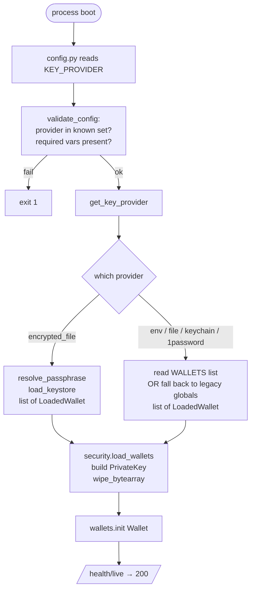

# Key providers

The service supports five backends for loading TRON private keys. Pick one based on your deployment shape and threat model. All five expose the same interface (`load_wallets() → list[LoadedWallet]`); the differences are operational.

## Comparison matrix

| Property | `1password` | `env` | `file` | `keychain` | `encrypted_file` |
|---|---|---|---|---|---|
| **Source** | 1Password CLI (`op`) | env var | chmod-600 file | macOS Keychain | AES-256-GCM JSON |
| **At rest** | encrypted by 1Password | plaintext in process env | plaintext on disk¹ | encrypted by macOS | AES-256-GCM |
| **In memory** | plaintext (PrivateKey lifetime) | plaintext (PrivateKey lifetime) | plaintext (PrivateKey lifetime) | plaintext (PrivateKey lifetime) | plaintext (PrivateKey lifetime) |
| **Multi-wallet** | ✅ via `WALLETS=` | ✅ via `WALLETS=` | ✅ via `WALLETS=` | ✅ via `WALLETS=` | ✅ native |
| **Container-safe** | ❌ needs `op signin` + biometric | ✅ | ✅ if file mounted | ❌ macOS only | ✅ |
| **Survives restart** | ✅ (re-prompt biometric) | ✅ (env injected by orchestrator) | ✅ | ✅ | ✅ |
| **Attack: file disclosure on the host** | safe — no plaintext on disk | safe — env, not disk | exposed: file contains hex | safe — encrypted by macOS | **safe — AES-256-GCM** |
| **Attack: env dump (`/proc/<pid>/environ`)** | safe (env never holds key) | exposed | safe (env not used) | safe (env not used) | safe — only passphrase, never key |
| **Attack: forgotten passphrase** | n/a | n/a | n/a | n/a | **keys lost forever** |
| **Setup complexity** | medium (biometric flow) | trivial | medium (chmod + path) | medium (security tool) | medium (passphrase mgmt) |

¹ `chmod 600` enforced at boot; the provider refuses to load anything looser.

## When to pick which

- **Operator-on-laptop, single-machine** → `1password` or `keychain`. Biometric unlock at boot, key never on disk in plaintext.
- **k8s / Cloud Run / Fly.io / any orchestrator with secret injection** → `env`. The platform handles rotation; a redeploy gives you a fresh value.
- **Plain VPS + systemd, single-tenant** → `file` for simplicity, `encrypted_file` if you want defence-in-depth against host-disk theft.
- **Docker on any host, needs multi-wallet** → `encrypted_file`. This is the recommended path for new installs; it gives you the "encrypted at rest, decrypted in memory" guarantee that 1Password gives the laptop case.
- **Air-gapped / cold-storage signing rig** → `file` on a removable read-only volume. Keep `SANCTIONS_LIST_REFRESH=false`.

---

## 1password

Reads the key from the 1Password CLI:

```bash
op item get "TRON-Treasury" --vault Treasury --fields password --reveal
```

The CLI must be on `PATH`, signed in (`op signin`), and the requested item/field must exist. Failure modes are deterministic — no item, returncode 1, exit. Wrong field, garbage hex, exit. Timeout, exit.

**Configuration:**

```bash
KEY_PROVIDER=1password
OP_VAULT=Treasury           # vault name
OP_ITEM=TRON-Treasury       # item name (single wallet)
OP_FIELD=password           # field inside the item
```

Multi-wallet:
```bash
WALLETS=hot,cold
WALLET_HOT_OP_ITEM=TRON-Hot
WALLET_COLD_OP_ITEM=TRON-Cold
# OP_VAULT + OP_FIELD remain shared across wallets
```

**The `lock()` step at shutdown** runs `op signout --all`, which re-locks the vault for the next process. This is best-effort — if `op` isn't on PATH it just logs a warning.

**Why not for containers:** `op signin` requires interactive biometric or the desktop app's auth socket. There is no clean way to pass that into a container.

---

## env

Reads from the `PRIVATE_KEY_HEX` env var (or `WALLET_<NAME>_PRIVATE_KEY_HEX` for each name in `WALLETS`).

**The variable is deleted from `os.environ` after read** so a child process can't inherit it. This is best-effort against memory-dumping attacks — see [Security model](security.md) for what `wipe_bytearray` actually buys you in CPython.

**Configuration:**

```bash
KEY_PROVIDER=env
PRIVATE_KEY_HEX=<64-hex-chars>          # single-wallet legacy
```

Multi-wallet:
```bash
KEY_PROVIDER=env
WALLETS=hot,cold
WALLET_HOT_PRIVATE_KEY_HEX=...
WALLET_COLD_PRIVATE_KEY_HEX=...
```

**Format accepted:** raw hex (64 chars), with or without `0x` prefix, trailing whitespace stripped. Anything else exits at boot with a clear error.

**`lock()` is a no-op** — there's no backend to sign out of.

**Watch out for `ps` and `/proc`:** while the variable is deleted from `os.environ` after read, anything running before that snapshot (a logging library that captured `os.environ`, a `ps eww` from another user) can still see it. The orchestrator's secret injection model is what you're trusting here.

---

## file

Reads the hex from a file at `PRIVATE_KEY_FILE`. Must be `chmod 600` (only the owner may read or write); the provider exits with a hard error otherwise.

```text
$ ls -l /etc/skr-crypto/treasury.key
-rw-------  1 skr  skr  64 Apr 30 12:00 /etc/skr-crypto/treasury.key
```

**Configuration:**

```bash
KEY_PROVIDER=file
PRIVATE_KEY_FILE=/etc/skr-crypto/treasury.key      # single-wallet legacy
```

Multi-wallet:
```bash
KEY_PROVIDER=file
WALLETS=hot,cold
WALLET_HOT_PRIVATE_KEY_FILE=/etc/skr-crypto/hot.key
WALLET_COLD_PRIVATE_KEY_FILE=/etc/skr-crypto/cold.key
```

**Why the chmod gate is strict:** a file at 0644 can be read by `nobody`, by any other process the kernel scheduler decides to run, and by anyone with a misconfigured backup. The treasury must be readable only by the service's user.

**`lock()` is a no-op.**

**Disk-encryption is your friend.** The file backend works best on a fully-encrypted volume (LUKS, FileVault, a cloud KMS-encrypted disk). Without that, a host-level disclosure exposes the key.

---

## keychain

Reads from the macOS Keychain via the system `security` tool:

```bash
security find-generic-password -s skr-crypto -a treasury -w
```

The key must have been stored via:

```bash
security add-generic-password -s skr-crypto -a treasury -w '<hex>' -U
# -U updates an existing item in place (rotation-friendly)
```

**Configuration:**

```bash
KEY_PROVIDER=keychain
KEYCHAIN_SERVICE=skr-crypto      # the `-s` argument
KEYCHAIN_ACCOUNT=treasury        # the `-a` argument
```

Multi-wallet:
```bash
KEY_PROVIDER=keychain
KEYCHAIN_SERVICE=skr-crypto      # shared
WALLETS=hot,cold
WALLET_HOT_KEYCHAIN_ACCOUNT=skr-hot
WALLET_COLD_KEYCHAIN_ACCOUNT=skr-cold
```

**Refuses to run on non-macOS** — `KEY_PROVIDER=keychain` on Linux exits at boot. (`sys.platform != "darwin"` check.)

**`lock()` is a no-op** — the keychain is system-managed.

---

## encrypted_file

The recommended provider for new installs. One chmod-600 JSON file holds N wallets, each encrypted with AES-256-GCM. A single passphrase (resolved at boot) derives the AES key via scrypt.

Full format spec: [Encrypted keystore format](keystore-format.md).

**Configuration:**

```bash
KEY_PROVIDER=encrypted_file
KEYSTORE_FILE=/var/lib/skr-crypto/data/keystore.json
# Passphrase resolution chain (first match wins):
KEY_PASSPHRASE=<passphrase>                 # 1. env var
KEY_PASSPHRASE_FILE=/run/secrets/keystore   # 2. chmod-600 file
# 3. interactive getpass prompt (only if stdin is a TTY)
```

The passphrase env var is **deleted from `os.environ` after read**. The file path requires chmod 600.

**The `WALLETS=` env var is ignored** — the keystore file is the source of truth for which wallets exist.

**Operations** are managed via `skr-crypto wallet ...`:

```bash
skr-crypto wallet encrypt -o data/keystore.json   # init
skr-crypto wallet generate hot
skr-crypto wallet add cold --hex <existing-hex>
skr-crypto wallet remove old-name
skr-crypto wallet rename hot warm
```

Each mutation decrypts the whole file, applies the change, re-encrypts with a fresh per-entry IV, and writes atomically (`O_EXCL` temp + `rename`). Salt is stable across these mutations; only re-`init` rotates the salt.

**Why this is right for containers:** the passphrase moves with secrets infrastructure (Docker secrets, k8s Secret env, Vault), the keys move with state volumes, and neither requires a TTY or a desktop app at boot.

---

## Resolution flow at boot



**Memory-handling invariant:** the raw 32-byte key lives only as a `bytearray` (mutable, zero-able) until a `tronpy.PrivateKey` is constructed from it. Then `wipe_bytearray` zeros the source. After that, the key bytes live inside the `PrivateKey` object's CPython internals — we can't deterministically wipe those (see [Security model](security.md)). The only way to drop them fully is process exit.

---

## Failure modes shared by all providers

| Behaviour | Cause | Resolution |
|---|---|---|
| Boot exits with "private key has wrong length" | The source returned non-32-byte data | Check the secret store contents; re-run `skr-crypto keygen` if needed |
| Boot exits with "not valid hex" | Source has whitespace, comments, or binary | Re-paste the value cleanly; remove `0x` prefixes if present |
| Boot exits with "duplicate wallet name from provider" | Multi-wallet config has the same name twice | Audit `WALLETS=` and per-wallet env vars |
| Boot exits with "PRIVATE_KEY_FILE has unsafe mode" | File chmod looser than 0600 | `chmod 600 <file>` |
| Wallet pool initialised with zero wallets | Provider returned `[]` (e.g. empty keystore) | Add at least one wallet before starting |

The one common thread: **boot fails fast, loud, and with a precise error**. Silent fallbacks aren't trusted on a money-mover.

---

## See also

- [Multi-wallet pool](multi-wallet.md) — how the loaded wallets are used
- [Encrypted keystore format](keystore-format.md) — exact byte layout for `encrypted_file`
- [Security model](security.md) — threat model + what wiping really buys you
- [ADR 0002 — Pluggable key providers](adr/0002-pluggable-key-providers.md) — why the abstraction looks like this
- [ADR 0006 — Encrypted keystore](adr/0006-encrypted-keystore.md) — why scrypt + AES-GCM and not GPG / age / argon2
