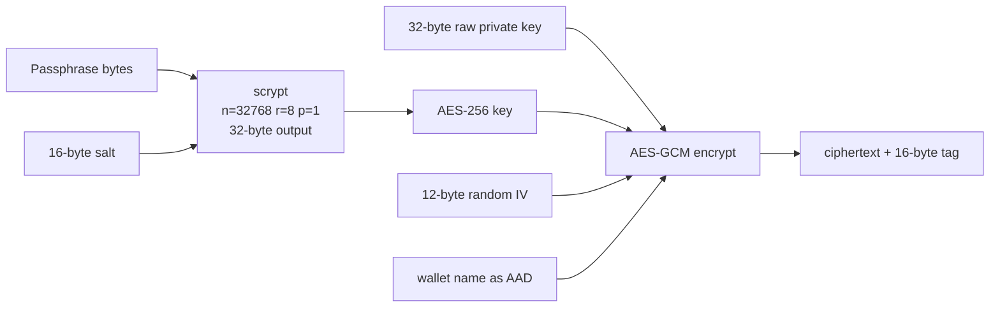

# Encrypted keystore format (v1)

This document is the spec for the on-disk file used by `KEY_PROVIDER=encrypted_file`. It's small enough to read end-to-end, deliberately. If you don't trust the format, don't use it.

Implementation: [`skr_crypto/server/encrypted_keystore.py`](https://github.com/vampir15551/skr-crypto/blob/main/skr_crypto/server/encrypted_keystore.py).

---

## Goals

1. **Multi-wallet in one file** — N keys, single passphrase, single salt.
2. **Decryptable without the running service** — anyone with the passphrase and a Python interpreter can recover the keys. No magic state, no DB.
3. **Auditable on inspection** — JSON, base64, no proprietary container.
4. **Atomic mutation** — `O_EXCL` temp + `rename`, so a crashed `wallet add` cannot leave a half-written file.
5. **AAD-bound** — wallet name is an AEAD additional-data input, so swapping ciphertext blobs between entries fails authentication.

## Non-goals

- **Forward secrecy.** A compromised passphrase compromises every key in the file.
- **Hiding the wallet count.** Anyone who can `cat` the file sees how many wallets are there. This is intentional — count is operational metadata, not a secret.
- **Hiding the addresses.** Each entry stores the public address as a hint for `skr-crypto wallet list --offline`. Treat addresses as public information; that's their job.

---

## File layout

A single JSON object:

```json
{
  "version": 1,
  "kdf": "scrypt",
  "kdf_params": {
    "n": 32768,
    "r": 8,
    "p": 1,
    "salt_b64": "<base64 16 bytes>"
  },
  "cipher": "aes-256-gcm",
  "wallets": [
    {
      "name": "main",
      "address": "TXxx…",
      "iv_b64": "<base64 12 bytes>",
      "ciphertext_b64": "<base64 32 + 16 bytes>"
    },
    {
      "name": "reserve",
      "address": "TYyy…",
      "iv_b64": "<base64 12 bytes>",
      "ciphertext_b64": "<base64 32 + 16 bytes>"
    }
  ]
}
```

**Field by field:**

| Field | Type | Bytes | Purpose |
|---|---|---|---|
| `version` | int | — | Format version. Currently `1`. Future versions will refuse to load on a `1`-only build. |
| `kdf` | string | — | Always `"scrypt"` in v1. |
| `kdf_params.n` | int | — | scrypt CPU/memory cost. v1 default `32768` (~30ms / 32MB on modern hardware). |
| `kdf_params.r` | int | — | scrypt block size. v1 default `8`. |
| `kdf_params.p` | int | — | scrypt parallelism. v1 default `1`. |
| `kdf_params.salt_b64` | string | 16 | Per-file salt. Re-rotated on `init_keystore(overwrite=True)`. |
| `cipher` | string | — | Always `"aes-256-gcm"` in v1. |
| `wallets[].name` | string | — | Operator-chosen label. Bound into AEAD AAD. |
| `wallets[].address` | string | — | Public TRON address. Hint for offline listing; not authoritative. |
| `wallets[].iv_b64` | string | 12 | NIST-recommended GCM IV. Generated fresh per encrypt. |
| `wallets[].ciphertext_b64` | string | 48 | 32-byte private key + 16-byte GCM tag. |

The file is written `chmod 600`. `load_keystore` refuses to read anything looser.

---

## Cryptographic construction



**One scrypt derivation per file**, not per wallet — adding the 100th key to a keystore costs the same scrypt as adding the first. `cryptography.hazmat.primitives.kdf.scrypt.Scrypt` is single-shot; we burn a fresh `Scrypt` instance per call.

**One IV per encrypt**, generated by `secrets.token_bytes(12)`. The same plaintext key encrypted twice produces different ciphertext blobs.

**Wallet name as AAD** binds each ciphertext to its name. Swap blobs between entries → `InvalidTag` on decrypt → `WrongPassphrase` raised (we don't distinguish "tampered file" from "wrong passphrase" on the wire — same UX either way).

---

## Why these primitives

### scrypt (not PBKDF2, not argon2id)

- **scrypt** is in `cryptography.hazmat.primitives.kdf.scrypt`. No extra dependency.
- **Memory-hard.** GPU brute-force is much harder than against PBKDF2.
- **Defaults at n=32768, r=8, p=1** cost ~30ms on a modern Mac and ~32 MB of RAM. Slow enough to discourage offline brute force, fast enough that a service restart isn't painful.
- **argon2id** would be marginally nicer but requires `argon2-cffi`, an extra wheel to ship for what's used once per process.
- **PBKDF2** is GPU-friendly. Don't.

### AES-256-GCM (not ChaCha20-Poly1305)

- **AES-NI** is everywhere we'd realistically run. Performance equivalent.
- The Python `cryptography` `AESGCM` API is the simplest one in the library — single call to encrypt/decrypt, tag handled internally.
- **256-bit key** matches what scrypt outputs at `length=32`.

### Raw bytes (not hex) as plaintext

- **Hex would mean** the plaintext is 64 ASCII chars instead of 32 raw bytes. Round-tripping back to bytes adds intermediate copies on the heap and an extra failure mode (bad hex) inside the decrypt path.
- **Bytes round-trip cleanly.** `bytes(decrypted)` directly into `tronpy.PrivateKey`.

---

## Atomic write semantics

Every mutating operation (`init_keystore`, `add_wallet`, `remove_wallet`, `rename_wallet`, `save_keystore`) goes through this sequence:

```python
def _atomic_write(path: Path, doc: dict, *, overwrite: bool) -> None:
    tmp = path.with_suffix(path.suffix + ".tmp")
    flags = os.O_WRONLY | os.O_CREAT | os.O_EXCL | os.O_TRUNC
    fd = os.open(str(tmp), flags, 0o600)
    try:
        os.write(fd, json.dumps(doc, indent=2).encode("utf-8"))
        os.fsync(fd)
    finally:
        os.close(fd)
    os.replace(str(tmp), str(path))
    os.chmod(str(path), 0o600)
```

- **`O_EXCL`** ensures no two `wallet add` runs collide on the temp file.
- **`fsync` before `rename`** persists the bytes before swapping the pointer.
- **`os.replace` is atomic on POSIX** within a single filesystem. The keystore file either contains the old keystore or the new one — never an interleaved write.
- **Belt-and-suspenders `chmod 600`** after rename — `replace` preserves source mode, but we set it again for safety.

If a crash happens mid-write, there's a `.tmp` file lying around but the real file is untouched. The next operation cleans up the stale `.tmp` automatically.

---

## Passphrase resolution

Implementation: `resolve_passphrase` in `encrypted_keystore.py`. The chain, first match wins:

1. **`env_var_value`** — already-extracted env var (caller passes `os.environ.get("KEY_PASSPHRASE")` and is expected to `del os.environ["KEY_PASSPHRASE"]` after).
2. **`file_path`** — chmod-600 file. Trailing `\r\n` stripped. Empty file → error.
3. **TTY prompt** — `getpass.getpass()`, only when `allow_tty_prompt=True` and `sys.stdin.isatty()`.

If none of the three resolve to a non-empty value, the function raises `KeystoreError` and the service refuses to start.

The CLI (`skr_crypto.cli.commands.wallet._resolve_passphrase_for_cli`) always allows the TTY prompt, since the CLI is interactive by definition.

---

## Worked example: encrypt → decrypt round trip

```python
from skr_crypto.server import encrypted_keystore as ks

# Init
ks.init_keystore("/tmp/keystore.json", b"correct-horse-battery-staple")

# Add
ks.add_wallet("/tmp/keystore.json", b"correct-horse-battery-staple",
    ks.KeystoreEntry(
        name="main",
        address="TXxx",
        raw_key=bytearray.fromhex("11" * 32),
    ))

# Inspect (no decrypt)
print(ks.list_wallet_names("/tmp/keystore.json"))
# ['main']

# Decrypt
entries = ks.load_keystore("/tmp/keystore.json", b"correct-horse-battery-staple")
print(entries[0].name, bytes(entries[0].raw_key).hex())
# main 1111111111111111111111111111111111111111111111111111111111111111

# Wrong passphrase
ks.load_keystore("/tmp/keystore.json", b"WRONG")
# raises ks.WrongPassphrase
```

The actual file content after `add_wallet`:

```json
{
  "version": 1,
  "kdf": "scrypt",
  "kdf_params": {
    "n": 32768,
    "r": 8,
    "p": 1,
    "salt_b64": "MzI4MTczMjg5MzgyMTM4MQ=="
  },
  "cipher": "aes-256-gcm",
  "wallets": [
    {
      "name": "main",
      "address": "TXxx",
      "iv_b64": "AhP7B0YzL3sB7e1M",
      "ciphertext_b64": "DECYE1vIBdZK6e/JXiXZmO9YYz+yyXIuClHHVJ5IF6Yp/0RwcEmlPdAegszAYDx9"
    }
  ]
}
```

(Salts/IVs/ciphertexts are random — your file will differ even with the same key + passphrase.)

---

## Error handling

| Exception | When | Caller should |
|---|---|---|
| `KeystoreNotFound` | File doesn't exist | Initialise with `init_keystore` first |
| `KeystoreCorrupt` | JSON malformed, fields missing/wrong types, duplicate wallet name in file | Restore from backup. **The file is unrecoverable**. |
| `KeystoreUnsupportedVersion` | `version` field doesn't match the running binary | Upgrade the binary, or migrate the keystore (no migration tool exists yet) |
| `WrongPassphrase` | AES-GCM tag mismatch on **any** wallet | Either passphrase wrong OR file tampered. Indistinguishable. |
| `WalletNameConflict` | `add_wallet` / `rename_wallet` to a name already in the file | Choose a different name |
| `KeystoreError` | Generic — empty passphrase, all-zero key, unsafe file mode | Read the message |

The common thread: **errors are precise, but never leak any portion of the key bytes**. Even a prefix could be a foot-gun if it landed in a log.

---

## What v2 might change (and why we held off)

We considered shipping the format with these features and didn't:

- **Per-wallet KDF parameters.** Lets you encrypt high-value wallets with stronger params. Decided against because (a) one passphrase gates everything anyway, (b) it complicates `add_wallet` and `rename_wallet`, (c) you can already partition by running multiple service instances with separate keystores.
- **Keystore-level AAD** (e.g. host name, deploy ID). Catches the case of a keystore being copied to a non-authorised host. Decided against because the file mode + filesystem-level disk encryption already address it, and AAD coupling makes legitimate restore-from-backup harder.
- **Argon2id.** Marginal improvement over scrypt at the cost of an extra wheel.
- **Detached metadata file.** Some keystore designs split the encrypted blobs from the public metadata. Decided against because one file is one backup; two files is a "we lost half".

If you need any of those, [open an issue](https://github.com/vampir15551/skr-crypto/issues) — but the bar is "concrete attack the current format doesn't address", not "could be cooler".

---

## See also

- [Multi-wallet pool](multi-wallet.md) — how the loaded wallets are used
- [Key providers](key-providers.md) — the four other backends
- [Security model](security.md) — what wiping really buys you in CPython
- [ADR 0006 — Encrypted keystore](adr/0006-encrypted-keystore.md) — design rationale
