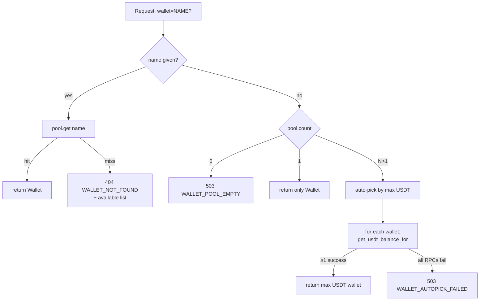

# Multi-wallet pool

Added in **1.4.0**. Replaces the single-wallet shape that every prior release shipped. This page is the reference for how the pool is populated, how a single request resolves to a wallet, and how the operator manages the set.

## TL;DR

- The service holds N wallets in a `WalletPool` singleton. Every signing operation goes through `pool.resolve(name)`.
- `name` is **optional** on every endpoint. Omit it and the pool either picks the only wallet (single-wallet deploy) or auto-picks by max USDT balance (multi-wallet deploy).
- Wallets are loaded by the configured `KEY_PROVIDER` at boot. There is no in-flight wallet rotation; mutations require a restart.
- The on-disk source of truth depends on the provider — for `encrypted_file` it's the keystore JSON, for others it's a list of env vars.

---

## Resolution semantics



**Implementation:** `skr_crypto/server/wallet_pool.py::WalletPool.resolve`.

The auto-pick path is **lazy** — balance lookups happen at request time, not cached on the pool. Cost: N TronGrid RPCs per /send when N > 1. For high-throughput multi-wallet deploys, prefer explicit `wallet=NAME` to skip the polling.

---

## Naming rules

Wallet names are operator-chosen labels used in logs, audit, env vars, and the keystore. Constraints:

- ASCII letters, digits, `_`, `-` only (validated at config + CLI level)
- Case-sensitive in the pool, but env-var suffixes uppercase (`hot` → `WALLET_HOT_PRIVATE_KEY_HEX`)
- Length up to 64 chars (Pydantic `Field(..., max_length=64)`)
- No two wallets in the same pool may share a name

The default name when migrating from a single-wallet legacy install is `default`. You can rename it via `skr-crypto wallet rename` (encrypted-file provider only).

---

## Per-provider configuration

Every backend supports both single-wallet (legacy globals) and multi-wallet (`WALLETS=` list) configuration. The `encrypted_file` provider is the only one where multi-wallet is the natural shape — the keystore file *is* the list.

### encrypted_file (recommended for new installs)

```bash
# .env
KEY_PROVIDER=encrypted_file
KEYSTORE_FILE=/var/lib/skr-crypto/data/keystore.json
KEY_PASSPHRASE=<from secret manager>
# OR
KEY_PASSPHRASE_FILE=/run/secrets/keystore.pass    # chmod 600
```

The `WALLETS` env var is **ignored** for this provider — the keystore file holds the wallet list. Manage it with:

```bash
skr-crypto wallet encrypt -o data/keystore.json   # one-shot init
skr-crypto wallet generate hot                    # add a fresh key
skr-crypto wallet add cold --hex <existing-hex>   # import an existing key
skr-crypto wallet remove old-name                 # decrypt-then-re-encrypt
skr-crypto wallet rename hot warm
```

Format spec: [Encrypted keystore format](keystore-format.md).

### env

Single-wallet (legacy):
```bash
KEY_PROVIDER=env
PRIVATE_KEY_HEX=<64-hex-chars>          # loaded as wallet "default"
# WALLETS not set
```

Multi-wallet:
```bash
KEY_PROVIDER=env
WALLETS=hot,cold,treasury
WALLET_HOT_PRIVATE_KEY_HEX=...
WALLET_COLD_PRIVATE_KEY_HEX=...
WALLET_TREASURY_PRIVATE_KEY_HEX=...
```

The env vars are **deleted from `os.environ` after read** so a child process can't inherit them. (See `key_providers.py::EnvKeyProvider._fetch_one`.) This means you can't restart the service from a shell that no longer has the variable — re-source the .env or pass via `env_file:` in compose.

### file

Single-wallet:
```bash
KEY_PROVIDER=file
PRIVATE_KEY_FILE=/etc/skr-crypto/treasury.key   # chmod 600
```

Multi-wallet:
```bash
KEY_PROVIDER=file
WALLETS=hot,cold
WALLET_HOT_PRIVATE_KEY_FILE=/etc/skr-crypto/hot.key
WALLET_COLD_PRIVATE_KEY_FILE=/etc/skr-crypto/cold.key
```

Each file must be `chmod 600` — the provider rejects anything looser at boot. There is no fall-through, no warning, just a hard exit.

### 1password

Single-wallet:
```bash
KEY_PROVIDER=1password
OP_VAULT=Treasury
OP_ITEM=TRON-Treasury
OP_FIELD=password
```

Multi-wallet (single shared vault):
```bash
KEY_PROVIDER=1password
OP_VAULT=Treasury           # shared
OP_FIELD=password           # shared
WALLETS=hot,cold
WALLET_HOT_OP_ITEM=TRON-Hot-Wallet
WALLET_COLD_OP_ITEM=TRON-Cold-Wallet
```

Requires `op signin` to be alive in the running shell. Doesn't work in containers.

### keychain

Single-wallet:
```bash
KEY_PROVIDER=keychain
KEYCHAIN_SERVICE=skr-crypto
KEYCHAIN_ACCOUNT=treasury
```

Multi-wallet (single shared service):
```bash
KEY_PROVIDER=keychain
KEYCHAIN_SERVICE=skr-crypto      # shared
WALLETS=hot,cold
WALLET_HOT_KEYCHAIN_ACCOUNT=skr-hot
WALLET_COLD_KEYCHAIN_ACCOUNT=skr-cold
```

macOS only. Doesn't work in containers.

---

## CLI subcommands

```text
skr-crypto wallet
├── list [--offline] [--json]   List configured wallets (online with balances, or offline)
├── show NAME [--json]          One wallet's live details
├── add NAME [--hex H] [--yes]  Import an existing key
├── generate NAME [--yes]       Generate a fresh random key + add
├── remove NAME [--yes]         Remove a wallet
├── rename OLD NEW              Rename (encrypted_file only)
└── encrypt [--from-hex|--from-env] [-o PATH] [--name N]
                                One-shot keystore initialisation
```

Mutating commands (`add`/`generate`/`remove`/`rename`/`encrypt`) **only modify state directly** for `KEY_PROVIDER=encrypted_file`. For `env`/`file`/`keychain`/`1password` they print the exact env-var or file-path layout you must apply manually — the CLI never tries to edit external secret stores on your behalf.

### Examples

**Online listing (service running):**
```text
$ skr-crypto wallet list
┏━━━━━━━━━━━━━━━━━━━━━━ Wallets (auto-pick: cold) ━━━━━━━━━━━━━━━━━━━━━━┓
┃ Wallet  Address                              USDT      TRX    Energy  ┃
┡━━━━━━━━━━━━━━━━━━━━━━━━━━━━━━━━━━━━━━━━━━━━━━━━━━━━━━━━━━━━━━━━━━━━━━━┩
│ cold    TXxxxxxxxxxxxxxxxxxxxxxxxxxxxxxxxx   12500.00  85.21  0       │
│ hot     TYyyyyyyyyyyyyyyyyyyyyyyyyyyyyyyyy     250.00  41.00  6500    │
└───────────────────────────────────────────────────────────────────────┘
```

**Offline listing (service down or `--offline`):**
```text
$ skr-crypto wallet list --offline
┏━━━━━━━━━━━━━━━━━━━━━━━━━━━ Wallets (offline) ━━━━━━━━━━━━━━━━━━━━━━━━━┓
┃ Wallet                                                                ┃
┡━━━━━━━━━━━━━━━━━━━━━━━━━━━━━━━━━━━━━━━━━━━━━━━━━━━━━━━━━━━━━━━━━━━━━━━┩
│ cold                                                                  │
│ hot                                                                   │
└───────────────────────────────────────────────────────────────────────┘
```

**Generating a new wallet for an `encrypted_file` install:**
```bash
$ skr-crypto wallet generate cold
This generates a fresh TRON private key. It is shown / persisted exactly once.
Generate now? [y/N]: y
Address: TColdwwwwwwwwwwwwwwwwwwwwwwwwwwwwww
Keystore passphrase: ********
✓ Added wallet 'cold' → TColdwwwwwwwwwwwwwwwwwwwwwwwwwwwwww
ℹ Restart the service for the new wallet to become signable: skr-crypto restart
```

**Adding to a non-`encrypted_file` provider — instructions only:**
```bash
$ skr-crypto wallet add reserve --hex 11...22
Address: TRsvxxxxxxxxxxxxxxxxxxxxxxxxxxxxxxx
Add wallet 'reserve'? [Y/n]: y
Address: TRsvxxxxxxxxxxxxxxxxxxxxxxxxxxxxxxx
export WALLET_RESERVE_PRIVATE_KEY_HEX=11...22
Append `reserve` to WALLETS in .env (comma-separated), then restart.
```

---

## Auto-pick: how it actually picks

The pool calls `tron.get_usdt_balance_for(wallet.address)` for each wallet:

- ≥ 1 successful lookup → returns the wallet with the highest balance.
- All lookups raised → `WalletAutoPickFailed` → 503 to the caller.
- Tie at the top? Whichever appears first in `pool.all()` wins (which is sorted alphabetically by name). Don't rely on this — give the wallets meaningfully different balances if you care.

The lookup is wrapped in `_with_retry` (3 attempts on transient errors), so a single 429 or 5xx doesn't disqualify a wallet. Sustained failures do.

The chosen wallet is logged before signing:
```text
[SEND] Using wallet | name=cold address=TColdxxxxx...
auto-pick: wallet=hot address=THotxxx...  usdt=250
auto-pick: wallet=cold address=TColdxxx... usdt=12500
auto-pick winner: wallet=cold address=TColdxxx... usdt=12500
```

---

## What auto-pick does **not** do

- **It does not consider TRX balance for fees.** The TRX-balance check happens *after* the wallet is chosen, in the /send preflight. If the chosen wallet has < `MIN_TRX_RESERVE` TRX, /send returns 400 `INSUFFICIENT_BALANCE`.
- **It does not redistribute load.** Auto-pick is greedy on USDT, not round-robin. If you want round-robin, name the wallets explicitly per request.
- **It does not consider risk profile per wallet.** Recipient risk is recipient-only.
- **It does not warm caches.** Each /send pays the lookup cost.

If these matter to your topology, pass `wallet=NAME` explicitly.

---

## Audit and metrics

Every `SEND_*` audit record carries the source-wallet name:

```json
{
  "event": "SEND_SUCCESS",
  "wallet": "cold",
  "from_address": "TColdxxxxxxxxxxxxxxxxxxxxxxxxxxxxxx",
  "to_address": "TRX9SbJzPbXYK1yw6VaFhCJ7ZKAoGwEPwy",
  "amount": "245.50",
  "txid": "abcd...",
  "details": "elapsed=1.43s risk=low",
  ...
}
```

The `[SEND] SUCCESS` log line includes both wallet and risk verdict:
```text
[SEND] SUCCESS | txid=abcd... wallet=cold TColdxxx -> TRX9SbJ... amount=245.50 USDT risk=low elapsed=1.43s
```

Prometheus metrics are wallet-agnostic — they label by **result** (`success`/`failed`) and **reason** (e.g. `risk_too_high`, `insufficient_usdt`), not by wallet. If you want per-wallet metrics, scrape /wallets and parse the JSON.

---

## Operations

- **Adding a wallet to a live deploy** — write the new key to your secret store (or run `wallet add` for `encrypted_file`), update `WALLETS=` if it's an env / file / 1password / keychain backend, restart the service. There is no in-flight reload.
- **Rotating a key** — same flow. The old wallet keeps appearing in audit records (its name is the operator-chosen label, not the address); decide whether to remove it from the pool or leave it as `cold-archive` for forensics.
- **Forcing a specific wallet for a transfer** — pass `"wallet": "name"` in the /send body. This is the only way to override auto-pick.
- **Health checks** — `/api/v1/health` reports `wallet_count` and `wallet_names`. A monitoring system can flag `wallet_count == 0` (boot failed to load any wallet).

---

## Failure modes you should know

| Symptom | Likely cause | Fix |
|---|---|---|
| /send → 404 `WALLET_NOT_FOUND` | Caller specified a name not in the pool | Check `wallet_names` in `/health`; correct spelling |
| /send → 503 `WALLET_POOL_EMPTY` | Boot loaded zero wallets (config error) | Check service logs for `WalletPool initialised with zero wallets` |
| /send → 503 `WALLET_AUTOPICK_FAILED` | All TronGrid RPCs are failing | Pass explicit `wallet=NAME`; investigate TronGrid status |
| Auto-pick keeps choosing the wrong wallet | Balances don't match expectations | `skr-crypto wallet list` to confirm; remember it picks max USDT, not TRX |
| `ENERGY_TOO_EXPENSIVE` on a normally-fine wallet | TRX balance fine, but recipient activation cost spiked | Stake TRX on the chosen wallet, or pass `wallet=` to a wallet with energy already staked |
| Adding a wallet to `KEY_PROVIDER=env` did nothing | Forgot to update `WALLETS=` | The list is the source of truth; `WALLET_*` vars without a name in `WALLETS` are ignored |

---

## See also

- [Encrypted keystore format](keystore-format.md) — the on-disk layout for `encrypted_file`
- [Key providers](key-providers.md) — full trade-offs for all 5 backends
- [HTTP API: /send](api-reference.md#post-apiv1send) — the wire-format details
- [Migration to 1.4](migration-1.4.md) — upgrading a 1.3.x deploy
- [ADR 0005 — Multi-wallet pool](adr/0005-multi-wallet-pool.md) — why the design looks like this
