# Risk preflight

Every `/api/v1/send` runs a recipient-risk preflight before broadcasting. The `/api/v1/risk/{address}` endpoint exposes the same logic standalone, so callers can pre-screen recipients before invoicing.

This page documents each of the eight checks: what it queries, what severity it reports, and when it fires.

## What it is for

Catching the failure modes of "broadcast OK, money silently didn't move" — which is what happens when:

- **Tether blacklists the recipient.** USDT contract's `transfer()` would revert; energy is still burned. Real failure mode, real money loss.
- **Recipient is a smart contract that doesn't implement TRC-20** (e.g. someone pasted a contract address by mistake). Same outcome — revert + energy loss.
- **Recipient is on the OFAC SDN list.** Sending to a sanctioned address may be a legal violation regardless of whether the tx lands.
- **Recipient is a known burn pattern.** The "sent to address-of-zeros" mistake.
- **Recipient is not activated.** Cold accounts cost ~18k extra energy on first credit.

And the more nuanced ones:

- **TronScan flags the address.** Community scam database, exchange hot wallet flags, mixer flags.
- **MistTrack flags the address.** SlowMist's AML attribution — counter-party analysis on mixers, hacks, sanctioned-entity proximity.

## Severity scale

```
LOW     all checks ok
MEDIUM  ≥ 1 advisory check warned (e.g. cold account)
HIGH    ≥ 1 check failed at "high" severity (sanctions, blacklist, contract dest)
INVALID address didn't even pass format validity
```

`/send` blocks when `level >= RISK_BLOCK_LEVEL` (default `high`). Configurable values: `none` (never block, but always audit), `medium` (block on warnings too), `high` (default, block only on high-severity).

## The eight checks

```mermaid
flowchart LR
    classDef ok fill:#d4edda,stroke:#155724
    classDef warn fill:#fff3cd,stroke:#856404
    classDef fail fill:#f8d7da,stroke:#721c24
    Addr[address] --> V[1. validity]
    V --> B[2. burn pattern]
    B --> Act[3. activation]
    Act --> SC[4. smart contract]
    SC --> BL[5. USDT blacklist]
    BL --> S[6. OFAC sanctions]
    S --> TS[7. TronScan reputation]
    TS --> MT[8. MistTrack AML]
```



### 1. Validity

**File:** `risk._validity_check`. **Severity on fail:** `invalid`. **Cost:** local-only.

Verifies the address is a 34-char base58check string starting with `T`, decoding to 21 bytes with `0x41` as the version byte (TRON mainnet). If not, every subsequent check is short-circuited and `level` is `invalid`.

This catches typos, EVM-style `0x...` addresses, and truncation.

### 2. Burn-address pattern

**File:** `risk._burn_address_check`. **Severity on fail:** `high`. **Cost:** local-only.

Checks against a known-burn list:

- `T9yD14Nj9j7xAB4dbGeiX9h8unkKHxuWwb` — null-address equivalent (all zeros after the prefix byte)
- A handful of community-known burn patterns

Sends to these are almost always mistakes. Refusing is cheap.

### 3. Activation

**File:** `risk._activation_check`. **Severity on fail:** `medium`. **Cost:** 1 TronGrid RPC.

Calls `client.get_account(address)`. If the account doesn't exist (or has no `create_time`), it's an unactivated address — the first incoming transfer pays for activation (~1 TRX worth of bandwidth + ~18k extra energy on USDT contract).

This **does not block** at the default `RISK_BLOCK_LEVEL=high`. It's a `medium` warning so the operator sees `risk=medium` in the audit trail and knows to expect higher gas on this one.

### 4. Smart contract destination

**File:** `risk._smart_contract_check`. **Severity on fail:** `high`. **Cost:** 1 TronGrid RPC.

Calls `client.get_contract(address)`. If it returns a contract object (not an exception), the destination is a smart contract. Sending USDT to a contract that doesn't implement TRC-20 reception is a guaranteed revert.

The exceptions list:

- The USDT contract itself (`USDT_CONTRACT` from config) — would never be a recipient, but if it is, that's the most obvious "you have a bug" case.
- The check fails on **any** contract by default. We don't try to introspect ABI to detect TRC-20 receivers — too easy to misclassify, and the operator can use `RISK_BLOCK_LEVEL=none` if they actually need to send to a contract.

### 5. USDT blacklist

**File:** `risk._usdt_blacklist_check`. **Severity on fail:** `high`. **Cost:** 1 TronGrid contract call.

Calls the USDT contract's `isBlackListed(address)` view function. Tether maintains an on-chain blacklist; addresses on it can receive USDT in flight (the transfer doesn't bounce mid-broadcast) but cannot move it out — the funds are effectively frozen.

This is the **most-bang-for-buck** check in the module: it catches a real, reproducible class of "broadcast OK, money silently didn't move" failures that operators have hit IRL.

### 6. OFAC SDN sanctions

**File:** `risk._sanctions_check` + `sanctions.py`. **Severity on fail:** `high`. **Cost:** local set lookup (~1 µs).

The service downloads the OFAC SDN list at boot (community-curated TRX-tagged subset from [`0xB10C/ofac-sanctioned-digital-currency-addresses`](https://github.com/0xB10C/ofac-sanctioned-digital-currency-addresses)). Refresh on every restart, with on-disk cache fallback for air-gapped deploys.

Set `SANCTIONS_LIST_REFRESH=false` to disable the network refresh and use only the on-disk cache (`$SKR_CRYPTO_HOME/data/ofac-sdn-trx.txt`). The check itself is always on — the only way to disable is `RISK_BLOCK_LEVEL=none`, which still records the verdict in audit.

**Why we don't query the OFAC API directly:** their site has rate limits and their canonical list isn't TRX-tagged out of the box. The community repo handles the parsing and is auto-updated when Treasury publishes new SDNs.

### 7. TronScan reputation

**File:** `risk._external_tronscan_check`. **Severity on fail:** `high` (or `medium` for warnings). **Cost:** 1 HTTP call to `apilist.tronscanapi.com` (~+200–500 ms).

Default-on since 1.3.0 (`RISK_USE_EXTERNAL=true`). Queries the public TronScan address-tag API. Tags include:

- `Scam` / `Phishing` → `high`
- `Mixer` → `high`
- `Exchange` (any) → `medium` warning (sending to an exchange hot wallet is fine, just notable)
- `Hacker` / `Stolen funds` → `high`

Disabled with `RISK_USE_EXTERNAL=false` (TronGrid-only mode). The check `skip`s cleanly on HTTP error or timeout — never blocks /send on a third-party outage.

### 8. MistTrack AML

**File:** `risk._external_misttrack_check`. **Severity on fail:** `high`. **Cost:** 1 HTTP call to `openapi.misttrack.io` (~+300–500 ms).

Opt-in via `MISTTRACK_API_KEY`. SlowMist's AML database — counter-party analysis on hacks, mixers, ransomware, sanctioned-entity proximity. Blocking thresholds:

- `risk_score >= 60` → `high`
- Any tag in the `high_risk_tags` set (`mixer`, `hack`, `sanctioned`, etc.) → `high`
- Otherwise → `low`

Free tier: ~100 requests/day. The check `skip`s when no key is configured — without a key it's a clean no-op that doesn't appear in the report's failed checks.

---

## Configuration

```bash
# Block-level. high (default), medium, none.
RISK_BLOCK_LEVEL=high

# External tier (TronScan). Default ON since 1.3.0.
RISK_USE_EXTERNAL=true

# OFAC SDN (always on; configure URL + refresh)
SANCTIONS_LIST_URL=https://raw.githubusercontent.com/0xB10C/ofac-sanctioned-digital-currency-addresses/lists/sanctioned_addresses_TRX.txt
SANCTIONS_LIST_REFRESH=true

# MistTrack AML. Empty = SKIP cleanly.
MISTTRACK_API_KEY=
```

---

## What ends up in the audit

Every `SEND_*` audit record includes the risk verdict:

```json
{
  "event": "SEND_SUCCESS",
  "wallet": "cold",
  "to_address": "TRX9SbJzPbXYK1yw6VaFhCJ7ZKAoGwEPwy",
  "amount": "245.50",
  "txid": "abc...",
  "details": "elapsed=1.43s risk=low",
  ...
}
```

```json
{
  "event": "SEND_REJECTED",
  "wallet": "cold",
  "to_address": "TRsanctionedxxx...",
  "amount": "100",
  "result": "risk_too_high",
  "details": "level=high failed=sanctions",
  ...
}
```

Forensic search "what fraction of /send failures was risk-blocked over the last week?":

```bash
grep '"event":"SEND_REJECTED"' audit.log | grep '"result":"risk_too_high"' | wc -l
```

---

## Performance

The Tier 1 checks (1–6) cost roughly:

- 3 TronGrid RPCs (account info, contract check, blacklist call)
- 1 set lookup (sanctions, microseconds)

Total: ~600–900 ms per /send on a healthy TronGrid free tier, ~200–400 ms with an API key.

Tier 2 (7) adds ~200–500 ms (TronScan).
Tier 2 (8, opt-in) adds ~300–500 ms (MistTrack).

For a multi-wallet auto-pick, add 1 USDT-balance RPC per wallet. So a 3-wallet pool with `RISK_USE_EXTERNAL=true` and MistTrack keyed: ~1.5–2 s per /send. Single-wallet, default config: ~1 s.

The `/send` global lock means these costs serialise. If you push >1 /send/sec you'll need to keep `RISK_USE_EXTERNAL=false` and stick to single-wallet (or shard across multiple service instances).

---

## Why we don't have...

- **Per-wallet block-levels.** Risk is recipient-only. A wallet's "personality" doesn't change which addresses you should refuse.
- **A "warn but don't block" mode for sanctions.** OFAC sanctions are legally consequential. The default has to be "block"; you can `RISK_BLOCK_LEVEL=none` if you really mean it, but we won't ship a knob that selectively defangs that one check.
- **Per-recipient cache.** The verdict varies day-to-day (TronScan tags, MistTrack scores update). A stale cache could silently let through a now-blacklisted address.
- **Webhooks for risk hits.** The audit trail is the source of truth; tail it and integrate with your own SIEM.

---

## See also

- [HTTP API: `/api/v1/risk`](api-reference.md#get-apiv1riskaddress) — wire format
- [HTTP API: `/api/v1/send`](api-reference.md#post-apiv1send) — how `/send` consumes the verdict
- [Audit log](audit-log.md) — record format
- [Configuration](configuration.md) — every risk-related env var
