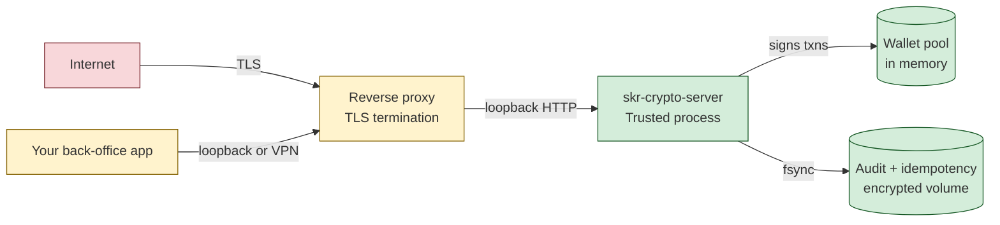

# Security Model

`skr-crypto` is a money mover. This document is the explicit threat model: what we defend against, what we don't, and what the operator is responsible for. If anything below is unclear or you suspect we got it wrong, [email the maintainer](#reporting-a-vulnerability) — don't open a public issue.

## Trust boundaries

The defended interior is one process, one filesystem volume, one OS user. Everything outside that boundary is treated as hostile or semi-trusted.

---

## What this codebase is and isn't

**The service** moves USDT TRC-20. It has the cryptographic material to do that.

**The CLI** is operator infrastructure. It can read state, edit config, manage the keystore *file*, but **it does not move money**. There is no `skr-crypto send` and there will not be one — money moves only through the authenticated HTTP API, where the audit log, idempotency, and risk preflight all apply.

If a future feature would let the CLI move funds, route it through the service's HTTP API and audit it there. We won't accept PRs that add a `skr-crypto send` or anything equivalent.

---

## Adversaries we consider

### 1. Network attacker on the wire

Mitigations:

- **Bind to localhost by default.** `SERVER_HOST=127.0.0.1`. The service is unreachable from the network without a reverse proxy.
- **`X-API-Key` constant-time compare.** No timing leaks against the auth token.
- **Rate limiting.** 30 req / 60 s per IP, 429 above. Doesn't defend against a determined attacker but eliminates the trivial brute-force-the-32-char-token case.
- **Request body size limit at Caddy.** 10 KB max for `/send` (the body is tiny — anyone sending more is probing).

The operator must:

- Put a TLS terminator (Caddy / nginx / Cloudflare Tunnel) in front for any public exposure.
- Restrict source IPs at the proxy when callers are known.
- Generate `AUTH_TOKEN` with `openssl rand -hex 32` — never a memorable string.
- Set `TRUSTED_PROXIES=` to the proxy's IP so the rate limiter and audit see real client IPs.

### 2. Caller code with the API token

Has full /send access. Mitigations:

- **Idempotency keys.** A buggy retry loop can't double-spend.
- **Rate limit per IP.** Caps damage from a runaway client.
- **Risk preflight.** OFAC + Tether blacklist + smart-contract refusal block the worst destinations regardless of caller intent.
- **Audit log.** Every action recorded with caller IP + idempotency key for forensics.

The operator must:

- Treat the API token like a database password. Rotate by re-running `skr-crypto install --force` or hand-editing `.env` and restarting.
- Issue separate tokens per caller if you have multiple callers — a future release may add this; for now, run one service instance per caller boundary.
- Monitor the audit + Prometheus metrics. Sudden bursts of `tx_rejected_total{reason="risk_too_high"}` mean something's wrong upstream.

### 3. Operator with shell access on the host

Same OS user as the service. Mitigations:

- **`.env` chmod 600** + `keystore.json` chmod 600 + `audit.log` chmod 600. Other-user processes can't read them.
- **The keystore passphrase** can live in a separate root-owned chmod-640 file (`/etc/skr-crypto/keystore.pass`), so the service-user account can read it but can't trivially exfil it via a local file disclosure.
- **Audit trail.** Every action is recorded. A malicious operator can edit the file but only after the fact — and the records that already landed are in the upstream backups.

We don't try to defend against the user we're shipping the tool to — the boundary is "they can't do anything that doesn't go through audit + risk preflight + idempotency."

### 4. Root on the host

Owns everything regardless. Mitigations:

- **Encrypted at rest.** With `KEY_PROVIDER=encrypted_file`, the keystore on disk is AES-256-GCM. Root can read the file but needs the passphrase to decrypt.
- **Memory** is plaintext while the process runs. Root can dump it. We accept this — see "What we explicitly don't defend against" below.

The operator must:

- Run on hosts they trust to be exclusive use. Money-movers don't share hosts with random workloads.
- Encrypt the underlying disk. LUKS / FileVault / cloud KMS-encrypted volumes. Defense in depth.

### 5. Stolen backup tarball

`skr-crypto backup` produces a tarball with `keystore.json` + `audit.log` + `idempotency.db` + `.env`. If that tarball ends up where it shouldn't:

- **Keystore is AES-256-GCM.** Useless without the passphrase.
- **`.env` does NOT contain the keystore passphrase** if you used `KEY_PASSPHRASE_FILE` (recommended). The passphrase file is separately backed up.
- **`AUTH_TOKEN` is in `.env`.** Rotate it (and restart the service) on suspicion of compromise.

The operator must:

- Encrypt backups in transit and at rest. `gpg --symmetric` on the tarball before pushing off-host is fine.
- Don't bundle the passphrase file in the same backup as the keystore. Two factors, two locations.

### 6. Compromised dependency

A malicious bump to `tronpy`, `cryptography`, `requests`, or any other PyPI dep. Mitigations:

- **Pinned versions** in `pyproject.toml`. Floating ranges only on bounded majors.
- **`pip-audit` on every CI run** flags known CVEs. Bandit in CI flags risky patterns.
- **Dependabot** for visibility on upstream releases.
- **No long-running background tasks.** Anything malicious has to fit in the request lifecycle.

The operator must:

- Run `skr-crypto update` regularly. Fixed-CVE versions are pinned forward; you have to upgrade to get them.
- Watch the GitHub release notes — major bumps occasionally include security-significant changes.

---

## What we explicitly don't defend against

These are out of scope. Defending them would buy little for the threat increase, or is impossible in CPython.

### Memory forensics on the live process

The TRON `PrivateKey` lives in CPython internals while the process runs. We can wipe the original `bytearray` (and we do), but the `PrivateKey` object's copy can't be deterministically zeroed. CPython's GC reclaims it eventually but doesn't zero the memory.

The strongest mitigations we can offer:

- **Short-lived processes.** `SHUTDOWN_TIMEOUT=600` (default) on local dev. In production, restart on a schedule (e.g. nightly via systemd).
- **Provider `lock()` on exit.** 1Password backend signs out; others are no-ops.
- **No swap.** Run on hosts where swap is disabled or backed by encrypted memory.

A determined adversary with `ptrace`-equivalent capability can extract the key from any signing process in any language. We treat this as the OS's problem to solve (LSM policies, locked-down `ptrace_scope`).

### Side-channel attacks on the cryptography library

We use `cryptography.hazmat.primitives.ciphers.aead.AESGCM` and `cryptography.hazmat.primitives.kdf.scrypt`. Both are constant-time on supported platforms. We don't audit the library ourselves — we trust the upstream maintainers and the wide deployment surface.

### Wallets that accept funds but lock them in

We refuse to send to OFAC SDN addresses, Tether-blacklisted addresses, smart contracts, and known burn patterns. We don't try to defend against:

- **A wallet that an exchange controls but the exchange has paused withdrawals.** The recipient is a normal address; we can't tell.
- **A wallet that's compromised mid-flight (ransomware, key theft) between caller validation and our broadcast.** Caller's job to detect.

### Determined social engineering

If your callers can be convinced to send to a malicious address, the risk preflight catches the well-known cases (TronScan-tagged scammers, OFAC addresses, contracts). Custom one-shot scams don't have a database to check against.

---

## Operator responsibilities, in priority order

1. **Encrypt the keystore at rest.** Use `KEY_PROVIDER=encrypted_file` if you don't have a 1Password / Keychain alternative.
2. **`AUTH_TOKEN` is 32+ random bytes.** `openssl rand -hex 32`. Never typed by hand. The doctor command warns if shorter.
3. **`.env` chmod 600**, owned by the service user. `keystore.json` chmod 600. `keystore.pass` chmod 640 if root-isolated.
4. **TLS in front of the service** for any non-loopback exposure. Caddy with Let's Encrypt is the smallest reasonable answer.
5. **Backups off-host, encrypted in transit.** Daily rsync to a separate machine. Verify a restore works at least once.
6. **Update discipline.** Subscribe to the repo's release notifications. `skr-crypto update` after each tag.
7. **Monitor.** Prometheus + alerts on `node_connected == 0`, 5xx rate, idempotency unresolved count, USDT/TRX low.
8. **Audit trail integrity.** Don't tail-truncate the audit log under any rotation regime. Move-then-touch breaks durability.

---

## What ends up in logs

Operational logs to stdout (text or JSON, configurable). Audit log to `AUDIT_LOG_FILE` (JSON, durable).

Things that **never** end up in either:

- `PRIVATE_KEY_HEX` or any portion of a private key.
- `KEY_PASSPHRASE` or its hash.
- `AUTH_TOKEN` or any portion of it. Comparison is via `hmac.compare_digest`; the value is never logged.
- `OP_*` field values (1Password reads via subprocess; output is bytes that go straight into the bytearray).

Things that **do** end up in logs:

- Wallet names and addresses (these are operator-chosen labels and on-chain public data).
- Recipient addresses, amounts, txids.
- Idempotency keys (caller-chosen, not secret).
- Risk verdicts.
- Client IPs.

If something sensitive shows up in a log we shouldn't have, [tell us](#reporting-a-vulnerability).

---

## Reporting a vulnerability

If you find a flaw that can:

- Compromise authentication
- Leak a private key (any portion)
- Bypass the audit log
- Bypass the idempotency guarantees
- Bypass the risk preflight or sanctions check
- Move funds in a way the audit doesn't capture

— **don't open a public issue**. Email the maintainer directly: `vampir15551 [at] users.noreply.github.com`.

We aim to:

- Acknowledge within 72 hours.
- Ship a patch within two weeks for anything graded high.
- Coordinate disclosure with you if you want it.
- Credit you in the release notes if you want it (or not, your call).

---

## See also

- [ADR 0004 — Audit hard-error](adr/0004-audit-hard-error.md) — why audit failure is 5xx, not a warning
- [Encrypted keystore format](keystore-format.md) — the cryptographic design
- [Key providers](key-providers.md) — trade-offs across the five backends
- [Risk preflight](risk-preflight.md) — what the eight checks actually defend against
